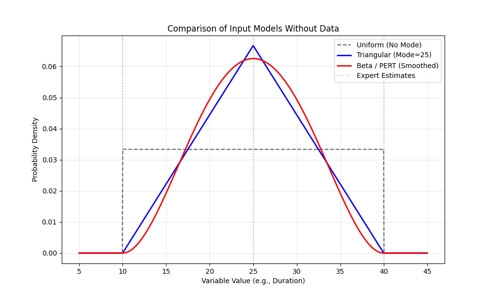

(sec:no_data)=
# Distribution modeling without data

:::{note} Thick Outline
To Henning, I doubt this section is of sufficient quality for
being an actual section. And here are my sources that I drew
from when making this thing:

<https://www.zajichekstats.com/post/can-you-have-a-model-without-data/>

<https://eng.libretexts.org/Bookshelves/Industrial_and_Systems_Engineering/Beyond_Lean_-_Simulation_in_Practice_(Standridge)/03%3A_Modeling_Random_Quantities/3.02%3A_Determining_a_Distribution_in_the_Absence_of_Data>

<https://rossetti.github.io/RossettiArenaBook/app-distfit-idms2sb4.html>

Feel free to burn this section down.

:::

As discussed in {ref}`sec:distribution_modeling`, modeling often begins with data collection. However, in many real-world scenarios—such as designing a new manufacturing facility, modeling a greenfield system, or simulating a rare event—historical data may be nonexistent or sparse. In these "no data" situations, the modeler must rely on alternative methods to characterize the uncertainty of the system.

This section outlines strategies for determining probability distributions without direct empirical data, often referred to as Input Modeling without Data.

## Conceptual Approaches

In this case, we must rely on domain expertise and physical constraints to inform our data-less model. The process shifts from statistical fitting to expert elicitation, where the goal is to extract knowledge from subject-matter experts (SMEs) and encode it into a mathematical form.

### Physical Constraints and Expert Opinion

The first step is to identify the physical limits of the variable. For example, a processing time cannot be negative, and a machine's capacity has a hard maximum. SMEs can often provide three key values with reasonable confidence:

- The Minimum (a): The absolute lowest possible value.
- The Maximum (b): The absolute highest possible value.
- The Mode (m): The most likely value (the peak of the distribution).

This "three-point estimation" approach is the foundation for selecting specific distributions that respect these boundaries.

### Bayesian Perspective

From a Bayesian perspective, the absence of data does not imply an absence of knowledge. We can construct a prior distribution that represents our current belief about the system based on intuition or similar systems. As data becomes available later (e.g., from a pilot run), this prior can be updated to a posterior distribution, allowing the model to evolve.

## Common Distributions for No-Data Scenarios

Three distributions (uniform, triangular, and beta) are commonly used when only the range [a,b] and potentially the mode m are known.

### The Uniform Distribution

If an expert can only provide the minimum (a) and maximum (b) values, but has no opinion on which values are more likely, the Uniform distribution is the appropriate choice. It assumes that all values between a and b are equally likely.

```{math}
f(x)=\frac{1}{b−a}​for a≤x≤b
```

This is often called the "maximum entropy" choice because it assumes the least amount of information about the shape of the uncertainty.

#### The Triangular Distribution

If the expert can provide a "most likely" value (m) in addition to the bounds, the Triangular distribution is the standard workhorse for simulation modeling. It is defined physically by these three parameters:

$$ f(x) = \begin{cases} \frac{2(x-a)}{(b-a)(m-a)} & \text{for } a \le x \le m \ \frac{2(b-x)}{(b-a)(b-m)} & \text{for } m < x \le b \end{cases} $$

It is simple to understand and explain to stakeholders, making it a popular choice for initial models.

#### The Beta (PERT) Distribution

While the Triangular distribution is easy to use, its sharp peak and straight lines may not realistically represent smooth natural phenomena. The Beta distribution is a more flexible alternative that can also be bounded on [a,b].

A specific variation often used in project management is the PERT distribution, which uses the same parameters (a,m,b) but assumes a smoother shape and often places more weight around the mode than the Triangular distribution. The mean of a PERT distribution is often approximated as a weighted average:

```{math}
\mu =6a+4m+b​.
```

## Examples of the No-Data Distributions with Python

The following Python code demonstrates how to generate and compare these distributions using scipy.stats and matplotlib. This comparison is crucial for showing SMEs how their estimates will affect the simulation inputs.



```{code-block}
import numpy as np
import matplotlib.pyplot as plt
from scipy.stats import uniform, triang, beta

# 1. Define Expert Parameters
min_val = 10   # a: Minimum optimistic time
mode_val = 25  # m: Most likely time
max_val = 40   # b: Maximum pessimistic time

# 2. Setup the Plot
x = np.linspace(min_val - 5, max_val + 5, 1000)
plt.figure(figsize=(10, 6))

# --- Uniform Distribution ---
# Defined by loc=min, scale=(max-min)
y_uniform = uniform.pdf(x, loc=min_val, scale=max_val-min_val)
plt.plot(x, y_uniform, 'k--', label='Uniform (No Mode)', alpha=0.6)

# --- Triangular Distribution ---
# Scipy parameter 'c' is the shape: (mode - min) / (max - min)
c_tri = (mode_val - min_val) / (max_val - min_val)
y_tri = triang.pdf(x, c_tri, loc=min_val, scale=max_val-min_val)
plt.plot(x, y_tri, 'b-', label=f'Triangular (Mode={mode_val})', linewidth=2)

# --- Beta (PERT) Distribution ---
# PERT approximation typically uses alpha = 1 + 4*(mode-min)/(max-min)
alpha_pert = 1 + 4 * (mode_val - min_val) / (max_val - min_val)
beta_pert = 1 + 4 * (max_val - mode_val) / (max_val - min_val)
y_beta = beta.pdf(x, alpha_pert, beta_pert, loc=min_val, scale=max_val-min_val)
plt.plot(x, y_beta, 'r-', label='Beta / PERT (Smoothed)', linewidth=2)

# 3. Formatting
plt.title('Comparison of Input Models Without Data')
plt.xlabel('Variable Value (e.g., Duration)')
plt.ylabel('Probability Density')
plt.axvline(min_val, color='gray', linestyle=':', alpha=0.5)
plt.axvline(max_val, color='gray', linestyle=':', alpha=0.5)
plt.axvline(mode_val, color='green', linestyle=':', alpha=0.3, label='Expert Estimates')
plt.legend()
plt.grid(True, alpha=0.3)
plt.show()
```

## Summary

Modeling without data requires a shift from statistical inference to expert elicitation. By obtaining simple bounds (a,b) and a most likely value (m), practitioners can use Uniform, Triangular, or Beta distributions to proceed with simulation. These assumptions should be documented clearly and replaced with data-driven distributions (or Bayesian posteriors) as soon as data becomes available.
