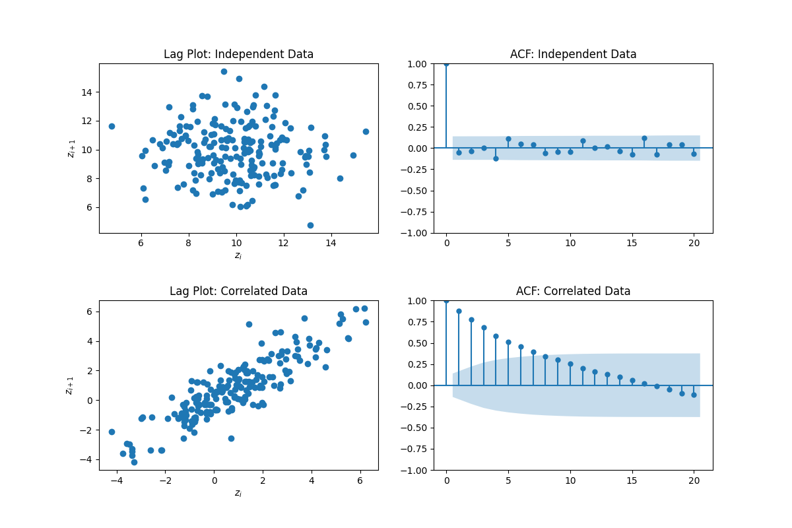
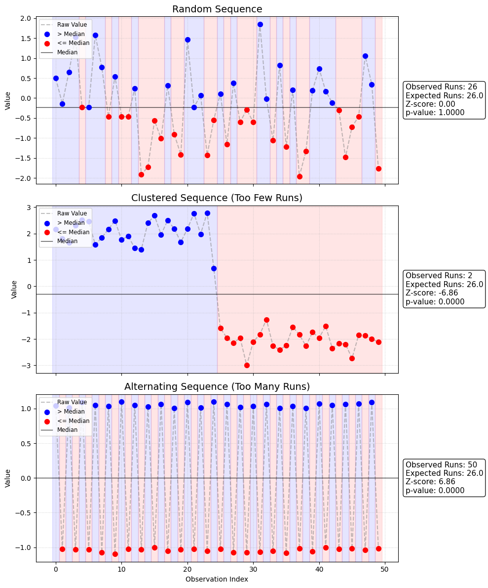

(sec:sample_independence)=
# Assessing sample independence

Most standard techniques for distribution modeling—including the Maximum Likelihood Estimation (MLE) methods discussed in {cite}`sec:distribution_examples` and goodness-of-fit tests—rely on a critical assumption: the data in our sample $Z={z_1​,z_2​,\dots,z_n​}$ must be Independent and Identically Distributed (IID).

While the "Identically Distributed" part is addressed by fitting a specific probability distribution, the "Independent" part is often overlooked. If the data points are correlated (e.g., the value of $z_i$​ depends on $z_{i−1}$​), standard variance estimates will be biased, and goodness-of-fit tests may reject valid models or accept invalid ones.

## Visual Assessment

Before applying formal statistical tests, it is best practice to visually inspect the data for dependencies.

- Time Series Plots: simply plotting the observations $z_i$​ against their index $i$ can reveal trends, cycles, or shifts in the mean that violate the IID assumption.

- Autocorrelation Function (ACF) Plots: The sample autocorrelation $\rho \cdot k$ kmeasures the correlation between observations separated by a lag k (i.e., between zi​ and zi+k​).

    - If the data is independent, ρk​ should be close to 0 for all $k \neq 0$.

    - Values falling outside the confidence bands suggest significant dependence.

- Lag Plots: A scatter plot of zi​ versus $z_{i+1}$​ (lag-1 plot) is a powerful tool.

    - If the data is independent, the cloud of points should be unstructured.

    - If the points cluster along a diagonal, there is strong positive correlation.

    - Circular patterns may indicate cyclic behavior.



```{code-cell}
:tags: [hide-input]

import numpy as np
import matplotlib.pyplot as plt
import pandas as pd
import statsmodels.api as sm
from statsmodels.graphics.tsaplots import plot_acf

np.random.seed(42)
n_samples = 200

# Generate Independent Data (White Noise)
data_iid = np.random.normal(loc=10, scale=2, size=n_samples)

# Generate Correlated Data (Random Walk / AR process)
data_corr = np.zeros(n_samples)
for i in range(1, n_samples):
    data_corr[i] = 0.9 * data_corr[i-1] + np.random.normal()

fig, axes = plt.subplots(2, 2, figsize=(12, 8))
plt.subplots_adjust(hspace=0.4)

# --- Row 1: Independent Data (Ideal Case) ---

# Lag Plot
pd.plotting.lag_plot(pd.Series(data_iid), ax=axes[0, 0])
axes[0, 0].set_title("Lag Plot: Independent Data")
axes[0, 0].set_xlabel("$z_i$")
axes[0, 0].set_ylabel("$z_{i+1}$")
# Note: Just a blob, no clear structure

# ACF Plot (Statsmodels)
# alpha=.05 draws the 95% confidence intervals
plot_acf(data_iid, ax=axes[0, 1], lags=20, alpha=0.05, title="ACF: Independent Data")

# --- Row 2: Correlated Data (Problematic Case) ---

# Lag Plot
pd.plotting.lag_plot(pd.Series(data_corr), ax=axes[1, 0])
axes[1, 0].set_title("Lag Plot: Correlated Data")
axes[1, 0].set_xlabel("$z_i$")
axes[1, 0].set_ylabel("$z_{i+1}$")
# Note: Strong diagonal alignment indicating dependence

# ACF Plot
plot_acf(data_corr, ax=axes[1, 1], lags=20, alpha=0.05, title="ACF: Correlated Data")
# Note: Bars extend well beyond the blue shaded confidence region

plt.show()
```

## Statistical Tests

Visual inspection is often subjective. To formally test the hypothesis $H_0$​: The sequence is independent, we can employ statistical tests.

- Runs Tests: These non-parametric tests analyze the sequence of values above or below the median (or the sequence of "ups" and "downs"). A "run" is a succession of identical events (e.g., +++ or --). Too few or too many runs indicate non-randomness.

- Autocorrelation Tests: Tests such as the Ljung-Box test or the Durbin-Watson statistic formally assess whether a group of autocorrelations are different from zero.

- Note: If independence is rejected, fitting a static distribution is likely inappropriate. In such cases, one must consider multivariate distributions, time-sersies models (e.g., ARMA), or stochastic processes that explicitly account for the correlation structure (see, e.g., {cite}`Banks:14`).

### Runs Test

The Runs Test is a non-parametric statistical test that checks a hypothesis of randomness for a two-valued data sequence. In the context of distribution modeling, we typically test for runs above and below the median or mean.

A "run" is defined as a succession of identical symbols which are followed and preceded by different symbols or by no symbol at all. 

Hypothesis: $H_0$​: The sequence of observations is random.

Procedure:

- Determine the median (or mean) of the sample $Z$.

- Assign a + if $z_i​> \text{median}$ and a − if $z_i​<\text{median}$.

- Count R, the total number of runs (clusters of consecutive + or −).

- Let $n_1$​ be the count of + and $n_2$​ be the count of −.

Visually, this procedure can look like the following image:



Under the null hypothesis of randomness, if the sample size $N=n_1​+n_2​$ is large (usually $N \ge 20$), the distribution of the number of runs R approximates a normal distribution with:

Mean $\mu_R$:

```{math}
:label: eq:runs_mean
\mu_R = \frac{2n_1 n_2}{n_1 + n_2} + 1
```

Variance $\sigma_R^2$:

```{math}
:label: eq:runs_variance
\sigma_R^2 = \frac{2n_1 n_2 (2n_1 n_2 - n_1 - n_2)}{(n_1 + n_2)^2 (n_1 + n_2 - 1)}
```

Test Statistic:

```{math}
:label: eq:runs_statistic
Z^* = \frac{R - \mu_R}{\sigma_R}
```

If $|Z^*|> Z_1− \frac{\alpha}{2}$​ (e.g., 1.96 for $\alpha=0.05$), we reject the null hypothesis of independence. A negative $Z^{*}$ usually indicates positive serial correlation, while a positive $Z^{*}$ indicates negative serial correlation.
