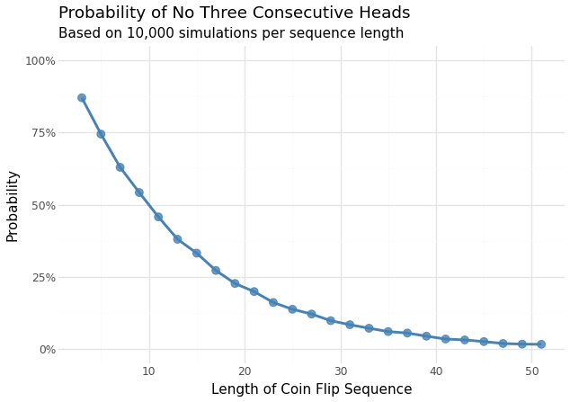

(ICPS)=
# In-Class Exercises

:::{note} A Note on the ICPSes in this section
:class: dropdown

This section is more of a view of possible in-class/in-lab graded work,
as many courses have adopted this format to great success at the University
of Virginia and beyond.
:::

## Monte Carlo-Based Problems

### ICPS 1: Bayes vs Simulation (Using Mathematical Results to Build Simulations)

Facebook has a content team that labels pieces of content on the platform as spam or not spam.
90% of them are diligent raters and will label 20% of the content as spam and 80% as non-spam.
The remaining 10% are non-diligent raters and will label 0% of the content as spam and 100% as
non-spam. Assume the pieces of content are labeled independently from one another, for every rater.
Given that a rater has labeled 4 pieces of content as good, what is the probability that they are a
diligent rater?

Produce a Crude Monte Carlo Simulation that is able to reproduce these results from the closed-form
formulation of Bayes' Theorem.

We will present a method for solving this with Bayes' Theorem, so the simulation based on this question
can be checked using an empirical method.

To use Bayes with the conditional probability established in the problem above, we need to understand the
event space through establishing a prior. In this case, we are assuming that there is a 0.9 probability of a
diligent rater with a 0.1 chance of a non-diligent rater.

From this, we can construct a table that defines the event space.

```{raw} latex
\begin{tabular}{|c|c|c|c|}
\hline
\multicolumn{2}{|c|}{Diligent: 0.9} & \multicolumn{2}{c|}{Non-diligent: 0.1} \\
\hline
Spam & Non-spam & Spam & Non-spam \\
\hline
0.2 & 0.8 & 0 & 1 \\
\hline
\end{tabular}
```

Once the probabilities $P(A|B)$, $P(B|A)$, $P(A)$, and $P(B)$ that constitute the Bayes Theorem are established,
then it shall be possible to use a closed-form formula to calculate the probability of these events occurring.

These events are defined as the following:

- $P(B|A)$ is defined as four pieces of content marked as non-spam by a diligent rater which is equal to $0.8^4$;
- $P(A)$ = The probability of selecting a diligent rater which is equal to 0.9;
- $P(B)$ = four pieces of content are marked as non-spam by either type of rater which is equal to $0.9 * 0.8^4 + 0.1 (1)$.

Now, the Bayes Theorem:

$$P(A|B) = \frac{P(B|A) * P(A)}{P(B)}$$

And as the values constituting this theorem for answering the question above are known, 
they can be substituted below to analytically solve this problem.

$$0.787 = \frac{0.8^4 * 0.9}{0.9 * 0.8^4 + 0.1 (1)}$$

Simulation answer:

```{code} python3
import numpy as np

n = 1000
four_non_spam_cases = 0
diligent_raters = 0

while four_non_spam_cases < n:
    is_diligent = np.random.binomial(1, 0.9, 1)[0]

    spam_count = 0
    for j in range(4):
        is_spam = 0
        if is_diligent:
            spam_count += np.random.binomial(1, 0.2, 1)[0]

    if spam_count == 0:
        four_non_spam_cases += 1
        diligent_raters += is_diligent

simulated_probability = diligent_raters / n # Monte Carlo Estimator

print(simulated_probability)
```

### ICPS 2: The Last Boarding Pass Puzzle
<!-- (Complex Simulations Over Solving A Difficult Mathematical Problem) -->

One hundred people are lined up with their boarding passes showing their seats on the 100 seat plane.
The first guy in line drops his pass as he enters the plane, and unable to pick it up with others
behind him sits in a random seat. The people behind him, who have their passes, sit in their seats
until one of them comes upon someone sitting in his seat, and takes his seat in a new randomly chosen seat.
This process continues until there is only one seat left for the last person.

What is the probability that the last person will sit in the correct seat?

There is a set of analytic solutions to this, which one will be discussed later, which is from
 {cite:p}`nigussie2014finding`. But an easier solution is simulation.

```{code} python
import numpy as np
import numba

@numba.njit
def boarding(num_seats=100):
    occupied = np.full(num_seats, False) # [Empty Seats]

    # Passenger 0 takes a random seat
    p0_choice = np.random.randint(0, num_seats)
    occupied[p0_choice] = True

    # All of the passengers after 0 pick a random unoccupied seat
    # IF the passenger before them took their seat. 
    for p_id in range(1, num_seats - 1):
        if not occupied[p_id]:
            occupied[p_id] = True
        else:
            unoccupied_indices = np.where(occupied == False)[0]
            choice = np.random.choice(unoccupied_indices)
            occupied[choice] = True
            
    # Return True if the last passenger's seat is NOT occupied (point of the puzzle)
    return not occupied[num_seats - 1]

trials = 3_000_000 # More Trials would be Better.
numerator = sum(boarding() for i in range(trials)) 
print(float(numerator) / trials)
```

In the solution above, the steps of the problem have been converted into
discrete actions on a matrix with random number assigning the seat where
the passenger sits. This is a form of Crude Monte Carlo. There are ways
to accelerate this process such as: parallelization, but this work will
not cover that method as it is out of scope.

In comparison to the simulation method, {cite:p}`nigussie2014finding`, constructs the following:

For $2 \le k \le n$, customer $c$ gets bumped when their seat is occupied by customer $k-1$, who was
also bumped by a customer $k-2$, and so on until customer 1.

This allows for the construction of a diagram showing the bumping process:

$$1 \to k_{1} \to k_{2} \to \dots \to k_{m} \to c$$

Then, the probability of this series of events is defined as

$$\frac{1}{n} \cdot \frac{1}{n+1 - k_1} \cdot \dots \frac{1}{(n+1)-k_{m}}$$

which then collapses into

$$p(k) = \frac{1}{n} \sum \prod_{\ell=1}^{m} \frac{1}{(n+1) - j_{\ell}}$$

Over the sets of the k values, which be expressed as the following:

$$p(k) = \frac{1}{n} \sum \prod_{\ell=1}^{m} \frac{1}{(n+1) - j_{\ell}}$$

Which when the summations are collapsed converts into:

$$p(k) = \frac{1}{n + 2 - k}$$

And in the case described in the question, $k = n$, we get $p(n) = \frac{1}{2}$, which is the same as the simulation method.

### ICPS 3: Feller's coin-tossing (Using Simulation to Check Complex Mathematical Results)

If you flip a coin n times, what is the probability there are no streaks of k heads in a row?

The question might seem to be directly answerable by using the binomial distribution's PDF, but that
is woefully insufficient. This is because the streak we are measuring in this question is NOT independent,
a fundamental assumption of using the binominal distribution. This problem is actually related to
Feller's coin-tossing constants and Fibonacci numbers, which simulation can do both approaches!

To illustrate how intractable this problem is using an analytic approach, we will begin with a sample of
30 flips, looking for a streak of length 3 or n = 30, k = 3.

```{code} python3
import numpy.random as random

random.seed(42)
flip_list = []

for i in range(30):
    flip = random.randint(0, 2)  # Generates either 0 or 1
    flip_list.append(flip)

print(flip_list)
```

As it has a set seed, it will always return the result below:

```{code} python3
[0, 1, 0, 0, 0, 1, 0, 0, 0, 1, 0, 0, 0, 0, 1, 0, 1, 1, 1, 0, 1, 0, 1, 1, 1, 1, 1, 1, 1, 1]
```

In this case, the result has one streak of length three, but doing this for a different result of a much
larger length would be less trivial. And through what method is possible for determining if this is
true for all sequences of any length - the ratio between the ones with a sequence and the ones without
can be defined as the frequentist definition of probability of p(30, 3). The downside of this is that it will take
$2^30$ sequences to discover this value using this method. This poses a set of problems that grow _exponentially_,
which is the total number of sequences and the second problem of specificity to one set of n or k.

There are several analytic solutions to this problem one of which is Feller's coin-tossing
constants. It is known that the for any independent tosses of a fair coin, there is
an asymptotic probability associated with it. Feller in 1968 stated that if the probability is
stated as $p(n,k)$, then the probability can be expressed as

$$ \lim_{n \to \infty} p(n, k)\alpha_k^{n+1} = \beta_k $$

And that $\alpha_k$ and $\beta_k$ can be defined as the smallest roots of

$$\alpha_k = x^{k+1} = 2^{k+1} (x-1)$$

and

$$\beta_k = \frac{2-\alpha_k}{k+1-k \cdot \alpha_k}$$

A example directly from {cite:t}`feller1971introduction` is one for $p(10,2)$ which is $\frac{9}{64} = 0.140625$
through the binominal distribution, with the approximation from Feller consisting of
$p(n,k) \approx \frac{\beta_k}{\alpha_k^{n+1}} = 0.1406263$.

However, it is easier and possible to exploit
the Law of Large Numbers in combination with Crude Monte Carlo to find this probability
without having to go through every possibility or taking limits. And it allows
for an easier exploration of different lengths.

Simulation Code:

```{code} python3
import numpy as np
import numpy.random as random
import pandas as pd

def streak_of_three_coin(parameter):
    windows = np.lib.stride_tricks.sliding_window_view(parameter, window_shape=3)
    return np.any(np.sum(windows, axis=1) == 3)

trials = 10_000 # This number of trials is arbitrary - but bigger is often better 

sequence_lengths = np.arange(3, 52, 2)
results = []

for length in sequence_lengths:
    success_count = 0
    for i in range(trials):
        flips = random.randint(0, 2, size=length)
        if not streak_of_three_coin(flips):
            success_count += 1
            
    probability = success_count / trials # Remember this from earlier?
    
    results.append({
        'sequence_length': length,
        'probability_of_no_three': probability
    })

sim_results_df = pd.DataFrame(results)
```

Which can be visualized as the following:



### ICPS 4: Coupon Collector Problem (Analytic vs Simulation)

A cereal company puts one of $n$ different collectible cards in each box. How many boxes 
do you expect to buy before collecting all $n$ cards?

The following provides an analytic answer to the question posed above. This is included for
checking your simulation work.

We begin with a unique card, as the first box will always contain a card that is new to you.
Now, the probability of getting a second unique card is $\frac{n-1}/n$ which can be represented
as a Bernoulli trial.

In this case, we notice that a series of Bernoulli trials is the Geometric
distribution as we are tracking the expected number until a success,
which is expressed as with:

$$\frac{1}{P(Success)} = \frac{n-1}$$

For the third unique card, the state space for possible new cards reduces to $n-2$,
so the probability is $\frac{n-2}{n}$ and the $E(trials)$ should be $\frac{n}{n-2}$.
This pattern continues for n until the entire state space is exhausted.

From this, it is possible to deduce the expected value as the sum of these
Bernoulli Trials.

$$E[X] = 1 + \frac{n}{n-1} + \frac{n}{n-2}  + \dots + \frac{n}{1}$$

Now, consider an instance of this problem with 9 cards, if this formula
is applied, the expected number of boxes required to get every card
would be about 25.46 boxes from the analytic solution.

Simulation Code:

```{code} python3
import random

def coupon_collector_simulation(num_cards, num_experiments):
    results = []
    
    for _ in range(num_experiments):
        collected_cards = set()
        boxes_bought = 0
        
        while len(collected_cards) < num_cards:
            card = random.randint(1, num_cards)
            collected_cards.add(card)
            boxes_bought += 1
            
        results.append(boxes_bought)
    
    return results

# Calculate theoretical expected value
def theoretical_expected_boxes(num_cards):
    harmonic_sum = sum(1/i for i in range(1, num_cards + 1))
    return num_cards * harmonic_sum
```

#### ICPS 4, Extension 1: Variance Estimation

As the simulation above provides a framework for analyzing the distribution, it is trivial
compared with the closed-form to estimate the variance with it.

```{code} python3
```

The Closed-Form Solution for Variance Estimation using begins by using
independence of random variables.
But which random variables? It might be best to use a Poisson process as it
allows for the generalized solution for the variance of any problem of this class.

In this solution, the assumption is that the poisson process has a rate of 1, and
that every coupon is of the same type $t$ with each probability being represented through
$p_c$, and when each $p_c$ is added together they are mutually exclusive and exhaustive.

Now, the expression for the total time, $T$, to collect every coupon, $C$,
must be found to define the survival function.
And through the survival function can be used to find the mean
and variance as they are expressions derived from the survival function.

$T = max_{1 < c < m} C_t$

Since we know that each coupon is independent (as they were generated from a Poisson Process),
we can now find the mean by using the survival function. Which


Which one of these solutions seems easier to implement and scale?

#### ICPS 4, Extension 2: Generalization Across M

A other associated problem with this is that the current closed-form analytical solution only applies when m is fixed,
to generalize this, we can either use the simulation or use the Erdős-Rényi method for it.

```{code} python3
```

The closed-form version of this is the limit of:
$$P(T_{m} < n log n + (m -1) n log log n + cn \rightarrow e^{-e}^{e} / (m-1)!$$ as n goes to infinity.

Which one of these solution is faster to calculate?

## Other Issues

### ICPS 6: On Rare Events
