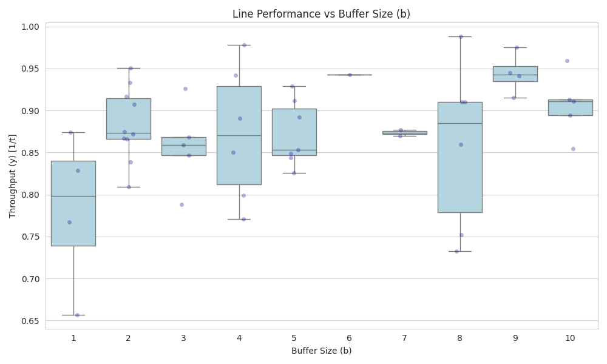
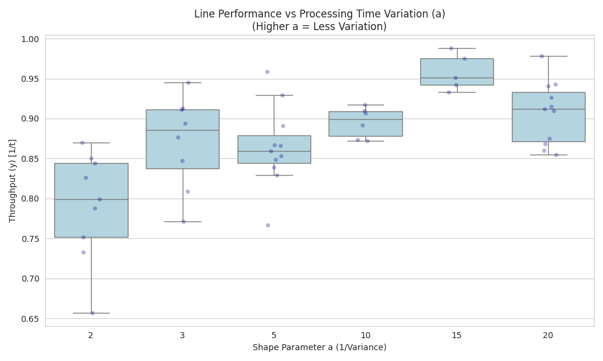
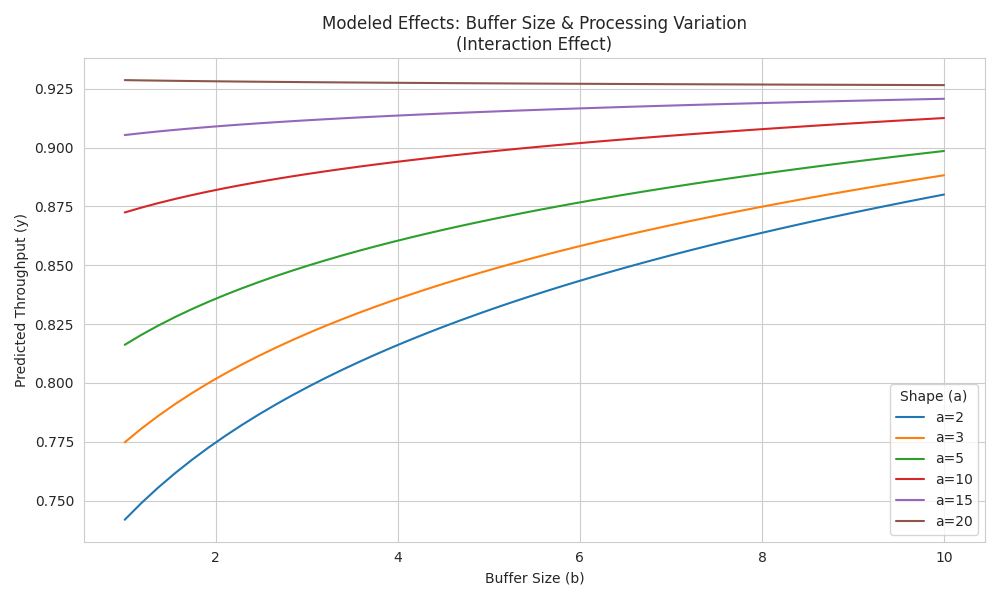
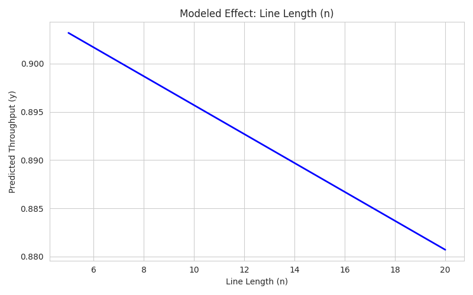
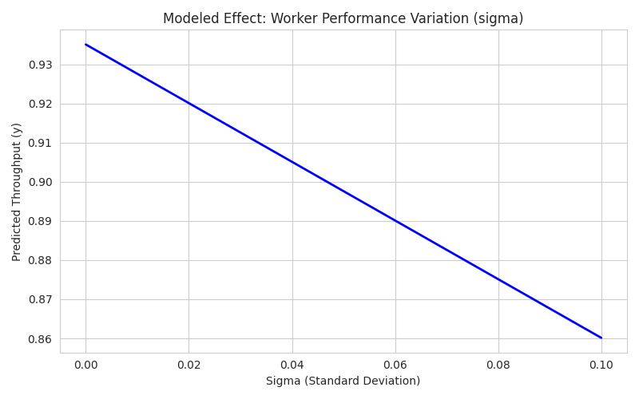

:::{admonition} Lab 6
:class: warning
(lab-6)=
# Lab 6: Queuing and Output Analysis in Simulation: Goldratt's Dice Game

Note: This lab is a bit of an odd one, as it is based on a book called
"The Goal" from Mr. Goldratt which is about the Theory of Constraints,
which is a fancy way of saying Linear Programming, which the reader has
likely taken a course on before if they are Industrial or Systems Engineering.
However, we are going to simulate one of the processes from this book, specifically
from pg. 105 in the third edition.

## Lab 6 Prerequisites

### Mandatory Pre-labs

- {ref}`prelab-2`
- {ref}`prelab-3`
- {ref}`prelab-4`
- {ref}`prelab-6`

### Mandatory Chapters for Lab 6

- {ref}`sec:prob_stats`
- {ref}`sec:distribution_modeling`
- {ref}`sec:random_number_generation`

## Background Information

In Eliyahu Goldratt’s classic business novel The Goal, the protagonist, Alex Rogo, thinks
manufacturing while on a hiking trip with a troop of Boy Scouts. He organizes a game
to demonstrate how a production line works.

The setup is deceptively simple. You have a line of workers (the scouts). The product
must pass from one worker to the next. However, there is a catch,
the speed at which a worker can pass matches is determined by rolling a die.

This means that this system can be represented as a series of five workers in sequence
on an assembly line. Each worker takes a mean 3.5 time units for processing
defined through a uniform distribution because of the die. Additionally, these workers have
infinite capacity (storage) for the items. This is a "balanced plant" model according to
industrial designers.

## Tasks

### Model Construction

First, a worker is defined as a entry buffer (a queue), with a time delay (processing time),
a output buffer, and a blocker which prevents the entrance of new material into the system. Next,
the connections between workers are established through the construction of a queuing network.
Programmatically, this can be implemented in Python using yield and store.get(). Now,
once the model is built, you should generate a graph of the inventory. For consistency,
set your seed to `42` using set.seed, this will make the random number generation reproducible.

However, the base model above has some problems: inaccurate modelling of process time and
excessive inventory. As the first problem can be seen by the use of a uniform distribution
in the base model, and the second problem is visible through the inventory graph.

For solving the first problem, replacing the uniform distribution with a gamma with a
mean of one is supportable based on distribution modelling based on natural boundaries.

For the second problem, a common solution for this comes from Six Sigma: Kanban.
In this case, Kanban means that we want to set a limit on how many inventory items are passing
through the system. This is set through a conditional: a worker cannot pass an item forward
if the next buffer has more than 5 items. This is the next modification that the model needs
for efficiency.

Once those tasks are done, the model should behave in a more efficient way, with a higher level
of throughput, document this number in some form. Along with having lower fluctuations (variance)
than the base model. To support this assertion, the throughout rate should be graphed and
average across 30 replications comparing the two models: new (with modifications) and base.

### Output Analysis: Experimental Design and Statistical Analysis

It is important to understand what factors in the system connect with
system performance metrics (in this case, it should be throughput rate, $y [1/t]$).
In this system, we want to construct
an experimental design to inform our output analysis. More details about experimental
design are available in Prelab 9, but here is a short summary; experimental design refers
to explaining the variance of factors within a series of different conditions.

In this lab, a full factorial design (3,300 runs) with varying line length, buffer sizes,
processing variation, and worker variation is recommended, as it is not computationally
expensive to do so (that's where the other factorial designs come in). Hint: Using itertools.product
makes it easier to get an appropriate set of combinations; and it might take a while to run
3,300 simulations on each of the unique sets of parameters.

Next, preforming exploratory data analysis across the event space will provide context on the impact of
each of the parameters. Then, generate summary statistics from the event space on the throughput,
and generate box plots for line performance vs line length, buffer size, performance time variation,
and worker performance variation to see the impact of each. Then fit a linear model using `statmodels`,
which will us to find the results of the four parameters on throughput rate.

## Example Output

### Plots of Output Measures





### Regression Results

```{raw} latex
\begin{center}
    \textbf{OLS Regression Results} \\
    \small Fitting Model: $y \sim 1 + n + \log(1+b) \times \log(a) + \text{sigma}$
\end{center}

\begin{table}[h!]
    \centering
    \small
    % Top Table: Model Summary
    \begin{tabular}{lclc}
        \toprule
        \textbf{Dep. Variable:}    & y                  & \textbf{R-squared:}         & 0.735     \\
        \textbf{Model:}            & OLS                & \textbf{Adj. R-squared:}    & 0.704     \\
        \textbf{Method:}           & Least Squares      & \textbf{F-statistic:}       & 24.36     \\
        \textbf{Date:}             & Mon, 15 Dec 2025   & \textbf{Prob (F-statistic):}& 1.15e-11  \\
        \textbf{Time:}             & 15:47:23           & \textbf{Log-Likelihood:}    & 98.009    \\
        \textbf{No. Observations:} & 50                 & \textbf{AIC:}               & -184.0    \\
        \textbf{Df Residuals:}     & 44                 & \textbf{BIC:}               & -172.5    \\
        \textbf{Df Model:}         & 5                  &                             &           \\
        \textbf{Covariance Type:}  & nonrobust          &                             &           \\
        \bottomrule
    \end{tabular}

    \vspace{0.3cm}

    % Middle Table: Coefficients
    \begin{tabular}{lcccccc}
        \toprule
                                     & \textbf{coef} & \textbf{std err} & \textbf{t} & \textbf{P$> |$t$|$} & \textbf{[0.025} & \textbf{0.975]} \\
        \midrule
        \textbf{Intercept}           & 0.6697        & 0.052            & 12.781     & 0.000               & 0.564           & 0.775           \\
        \textbf{n}                   & -0.0015       & 0.001            & -1.358     & 0.181               & -0.004          & 0.001           \\
        \textbf{np.log(1 + b)}       & 0.1058        & 0.026            & 4.087      & 0.000               & 0.054           & 0.158           \\
        \textbf{np.log(a)}           & 0.1059        & 0.024            & 4.457      & 0.000               & 0.058           & 0.154           \\
        \textbf{np.log(1 + b):np.log(a)} & -0.0357   & 0.013            & -2.792     & 0.008               & -0.062          & -0.010          \\
        \textbf{sigma}               & -0.7492       & 0.157            & -4.775     & 0.000               & -1.065          & -0.433          \\
        \bottomrule
    \end{tabular}

    \vspace{0.3cm}

    % Bottom Table: Residual Tests
    \begin{tabular}{lclc}
        \toprule
        \textbf{Omnibus:}       & 4.346  & \textbf{Durbin-Watson:}     & 2.169 \\
        \textbf{Prob(Omnibus):} & 0.114  & \textbf{Jarque-Bera (JB):}  & 3.255 \\
        \textbf{Skew:}          & -0.486 & \textbf{Prob(JB):}          & 0.196 \\
        \textbf{Kurtosis:}      & 3.786  & \textbf{Cond. No.}          & 386.  \\
        \bottomrule
    \end{tabular}

    \flushleft
    \footnotesize
    \textbf{Notes:} \\
    {[1]} Standard Errors assume that the covariance matrix of the errors is correctly specified.
\end{table}
```

### Linear Regression Results







:::
