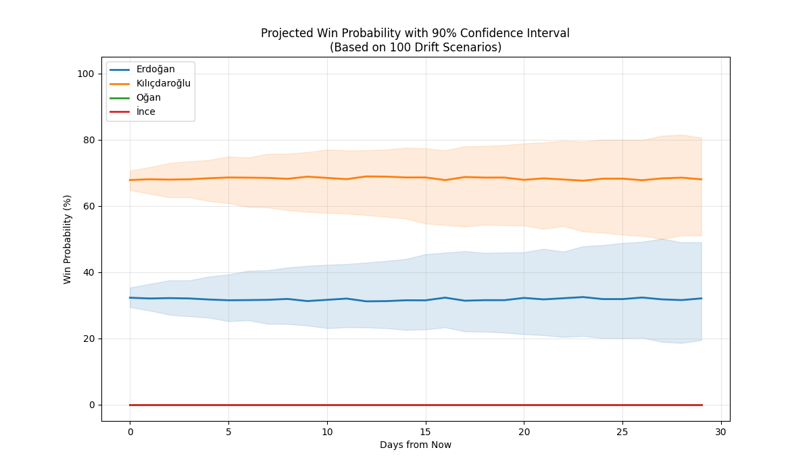

(lab-8)=
# Lab 8: Comparing Two Modelling Methodologies (ABM vs MC): Simulating an Election

:::{admonition} Lab 8
:class: attention

## Lab 8 Prerequisites

### Pre-labs

- {ref}`prelab-3`
- {ref}`prelab-7`
- {ref}`prelab-4`
- {ref}`prelab-5`

### Chapters

- {ref}`sec:QuasiMC`
- {ref}`sec:agent_based_models`
- {ref}`sec:CrudeMC`
- {ref}`sec:distribution_modeling`

## Background Information

For many years, statisticians and engineers have used different modelling techniques
for predictions based on the Monte Carlo method, and some of the major subjects of
these modelling techniques are: elections, weather, and engineering systems. This
lab builds on three sources: {cite}`mann1960values`, {cite}`kononovicius2017empirical`,
and {cite}`pasek2015predicting`.

### Agent-Based Modelling (ABM)

As discussed in {ref}`prelab-3`, Agent-Based Modelling is a modelling technique that focuses on how agents
interact with other agents in a system. For example, in a swarm of bees, a simulation based on ABM will represent
them as agents with a limited set of possible interactions with the environment and other agents
such as move, collide, and avoid. This approach allows for an agent to influence the surrounding environment.

### Monte Carlo (MC) Review

The reader is most likely familiar with Monte Carlo at this point in the book; however, here is a
review of what is Monte Carlo in this context. When using the Monte Carlo method for simulative prediction, the
Monte Carlo Method uses random variables to predict probabilistic events. Through aggregating these
experiments (elections), it becomes possible to determine based on a set of assumptions the likelihood
of an event occurring (a party or candidate winning an election).

## Tasks

### Implementing an Agent-Based Modelling Election Model

To implement an Agent-Based Modelling (ABM) model for elections, we first need to find appropriate data,
luckily enough, we have data that we can work with from {cite}`kononovicius2017empirical`. In this lab,
we will try to reproduce the 2012 election using an abridged and programmatic method based on the paper.
This section is basically a walk-through of how to roughly do this for the 1992 election, but it should
be a relatively simple swap.

Then, we have to consider the distribution that fits the behavior of the data. A reasonable hypothesis
using Phitter is the beta distribution, although other distributions match the data sufficiently well.

For example, if we fit the data for the 1992 elections for the top five parties using distfit
from {},
we get a set of parameters pretty similar to the original paper.

```{raw} latex
\begin{tabular}{rrlllrl}
\toprule
year & org\_id & party & alpha & beta & n & mean\_share \\
\midrule
1992 & 15 & LDDP & 5.035 & 5.508 & 2060 & 0.4793 \\
1992 & 1 & Reform Movement (Sąjūdis) & 3.117 & 13.36 & 2056 & 0.1901 \\
1992 & 14 & LKDP & 2.255 & 15.47 & 2042 & 0.1273 \\
1992 & 7 & LLRA-KSS (EAPL-CFA) & 0.2647 & 2.481 & 809 & 0.07854 \\
1992 & 4 & LSDP & 2.55 & 46.94 & 2020 & 0.05156 \\
\bottomrule
\end{tabular}
```

Now, a common ABM model for the beta distribution is the
Kirman Two State Model, which is expressed as a Markov
Chain with specific state transitions probabilities:

```{raw} latex
Let $X$ be the number of agents in State 1. The transition probabilities in time step $\Delta t$ are:
\begin{align*}
    P(X \to X+1) &= (N-X)(\sigma_1 + hX)\Delta t \quad \\
    P(X \to X-1) &= X[\sigma_2 + h(N-X)]\Delta t \quad 
\end{align*}


\begin{itemize}
    \item $\sigma_1, \sigma_2$: Idiosyncratic attractiveness of the states.
    \item $h$: Recruitment efficiency parameter.
\end{itemize}
```

And if the system is at an infinite number of agents, the
entire system can be expressed using the Fokker-Planck Equation (FP).
Moreover, if the FP equation has the following form with
drift $A(x)$ and diffusion $B(x)$, then when it has a sufficiently
large number of samples converges into the Beta Distribution as
shown below.

```{raw} latex
For large $N$, the fraction $x = X/N$ is described by a Fokker-Planck equation 
\begin{align*}
    A(x) &= \epsilon_1(1-x) - \epsilon_2 x \quad \text{where } \epsilon_i = \sigma_i/h \\
    B(x) &= 2x(1-x) 
\end{align*}

The long-term behavior follows a Beta distribution, $Be(\epsilon_1, \epsilon_2)$:
\begin{equation*}
    \omega_{st}(x) = \frac{1}{B(\epsilon_1, \epsilon_2)} x^{\epsilon_1-1}(1-x)^{\epsilon_2-1}
\end{equation*}
```

Doing this programmatically is easier than what the notation indicates!

```{admonition} Code for the Kirman Two State Model
:class: dropdown tip

```{code} python
class KirmanTwoStateModel:
    def __init__(self, n_agents, epsilon_1, epsilon_2, h):
        self.N = n_agents
        self.state = np.random.randint(0, self.N) 
        self.e1 = epsilon_1
        self.e2 = epsilon_2
        self.h = h

    def step(self):
        n1 = self.state
        n2 = self.N - n1

        # The Transition Probabilities 
        p_1_to_2 = (n1 / self.N) * (self.e2 + self.h * n2) / (self.e1 + self.e2 + self.h * self.N)
        p_2_to_1 = (n2 / self.N) * (self.e1 + self.h * n1) / (self.e1 + self.e2 + self.h * self.N)

        r = np.random.rand()
        if r < p_1_to_2: self.state -= 1
        elif r < p_1_to_2 + p_2_to_1: self.state += 1

    def run(self, steps, record_every=100):
        history = np.zeros(steps // record_every)
        for i in range(len(history)):
            for _ in range(record_every):
                self.step()
            history[i] = self.state / self.N
        return history
```
```
```

Which might seem complex, but we can break it down a bit more.

1. The Setup: `__init__`

- self.N (Population): The total number of agents (e.g., traders, ants).
- self.state (Current Situation): Instead of tracking every single agent individually (which is slow),
we only need to track how many agents are in State 1.

The Parameters (ϵ and h):

- ϵ (Noise/Idiosyncratic): The tendency to switch states randomly/independently (e.g., "I just felt like changing my mind").
- h (Herding): The tendency to copy others (e.g., "Everyone else is voting this way, so I will too").

2. The Mechanics: `step`

With every tick of the clock, we need to count the number of people who are in the first group (stay)
and the second group (switch), which are what `n1` and `n2` represent.

Then we need to define the Markov Transitions in our code based on opportunity and pressure:

- Opportunity: (`n1 / self.N`) is the chance of randomly picking an agent who is currently in State 1.
- Pressure: (`self.e2 + self.h * n2`) is the pressure to move to State 2 that represents agent preference and
peer pressure.

And these factors allow for us to create an approximation of the Markovian Transition Rates.

After implementing this, we can now visualize our results for each party, in this example,
we used the Reform party and compare it against the beta distribution fit.

### Example of ABM-Model Output


This model had the following parameters: 2,000,000 steps, h = 1, agents = 500.

### Implementing a Quasi-Monte Carlo-Based Simulation Model

In this lab, we will be using polling data from the 2023 Turkish Election
from <https://en.wikipedia.org/wiki/Opinion_polling_for_the_2023_Turkish_presidential_election>
to do three things:

1) Construct the random variables defining the estimators for voting
percentages per major party candidate
based on a Gaussian Distribution based on the opinion polling data;
2) Then we need to consider that opinions can shift because of the
data's margin of error and natural, Gaussian shifts in the environment
informed through polling changes overtime;
3) Finally, then we can use this information to make a randomized
Quasi-Monte Carlo Simulation of the data and get a confidence interval
for the probability of victory for the candidates.

```{code} python
import numpy as np
import matplotlib.pyplot as plt
import datetime
import io
from scipy.stats import qmc, norm

# Starting Code (CSV)
csv_data = """Date,Polling firm,Erdoğan,Kılıçdaroğlu,Oğan,İnce
15-20 Apr,AREDA,51.4,41.8,2.2,4.6
14-16 Apr,Yöneylem,43.0,48.6,2.8,5.8
10-16 Apr,SONAR,46.1,44.1,2.1,7.7
10-16 Apr,AKSOY,38.4,47.9,4.8,9.0
10-16 Apr,MAK,43.7,47.8,1.1,3.4
12-14 Apr,AREDA,50.8,43.1,1.6,4.5
13-Apr,AR-G,45.6,49.2,1.3,3.9
8-12 Apr,ALF,43.9,47.4,2.2,6.5
7-11 Apr,ORC,41.5,48.9,2.4,7.2
6-10 Apr,Avrasya,42.3,50.9,2.0,4.8
09-Apr,SAROS,46.8,45.7,1.6,6.0
3-8 Apr,TAG,42.9,51.4,1.6,4.1
1-8 Apr,Optimar,47.45,45.9,1.7,8.3
1-4 Apr,TekAr,45.8,46.2,2.4,5.6
1-3 Apr,MetroPoll,41.1,42.6,2.2,5.0
1-2 Apr,Gezici,43.2,53.4,1.3,2.1
25 Mar-2 Apr,ASAL,46.8,42.2,2.6,8.4
28 Mar-1 Apr,AREDA,50.6,41.8,2.1,5.5
31-Mar,MetroPoll,42.0,44.6,0.0,0.0
28-30 Mar,Ankara Analitik,44.5,39.7,1.5,14.3
27-29 Mar,Yöneylem,41.6,46.4,2.9,9.1
13-21 Mar,Artıbir,44.0,51.3,1.2,3.5
20-Mar,SAROS,44.3,45.5,0.0,3.1
13-18 Mar,Optimar,47.4,45.3,0.7,6.5
12-17 Mar,Avrasya,39.7,53.5,1.4,2.9
13-15 Mar,TAG,43.2,45.4,3.6,5.5
11-15 Mar,ORC,42.3,53.1,1.5,3.1
17-Mar,Themis,32.1,36.8,12.2,7.9
15-Mar,MAK,45.7,51.1,0.0,0.0
14-Mar,AR-G,43.1,46.2,3.1,7.6"""

df = pd.read_csv(io.StringIO(csv_data))

```

The next step after we get the data and do some basic processing
(obtaining the means and getting standard deviations
with np.mean and np.std for example),
to it is to use these parameters to define random variables.

After that, we can set up the randomization method for QMC
through the Sobol Sampler based on completing the following
set of code based on what is known about Quasi-Monte Carlo
Methods.

```{code} python
num_days = 30
daily_drift_volatility = 0.2

# TODO: Define num_universes and m
num_universes = ___
m = ___
num_samples_per_universe = 2**m

# TODO: Initialize current_means using np.tile
current_means = ___

# Initialize storage for stats (Days, Metrics, Candidates)
history_stats = np.zeros((num_days, 3, 4))

# Create the Quasi-Monte Carlo Sampler (Sobol Sequence)
sampler = qmc.Sobol(d=4, scramble=True)
```

Then we build the main body of the simulation
along with defining the drift of the population
overtime:

```{code} python
for day in range(num_days):
    
    # APPLY DRIFT
    # TODO: Generate drift noise of shape (num_universes, 4)
    drift = np.random.normal(0, daily_drift_volatility, size=(___, ___))
    current_means += drift
    
    # GENERATE QMC ESTIMATOR
    # TODO: Get uniform samples
    u_samples = sampler.random(___)
    
    # TODO: Convert to Normal distribution using norm.ppf
    z_scores = norm.ppf(___)
    
    # CALCULATE VOTE SHARES (Provided)
    # This broadcasts (100, 1, 4) against (1, 8192, 4)
    # Result shape: (100, 8192, 4)
    sim_votes = current_means[:, None, :] + (base_stds[None, None, :] * z_scores[None, :, :])
    
    # DETERMINE WINNERS
    # Find the index of the max vote in the last axis
    winners = np.argmax(sim_votes, axis=2)
    
    # Calculate win percentage for each universe
    win_probs_per_universe = (np.arange(4) == winners[..., None]).mean(axis=1) * 100
    
    # We calculate the Median, 5th percentile, and 95th percentile across universes
    history_stats[day, 0, :] = np.median(win_probs_per_universe, axis=0)
    history_stats[day, 1, :] = np.percentile(win_probs_per_universe, 5, axis=0)
    history_stats[day, 2, :] = np.percentile(win_probs_per_universe, 95, axis=0)

print("Simulation Complete.")
```

Then visualize the results similarly to the following output:


:::
