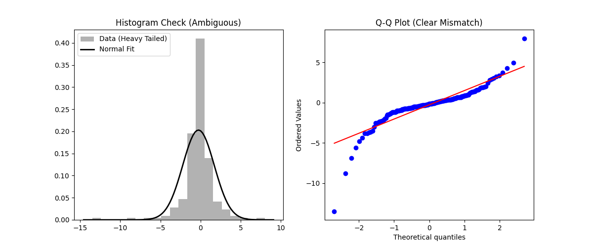

(prelab-7)=
# Prelab 7, On Automated Distribution Fitters (i.e: Phitter, Distfit)

Distribution fitting is the procedure of selecting a statistical distribution
that best describes a dataset generated by some random process.
In simulation, this is the bridge between raw data collection and the
creation of valid stochastic inputs for your model.

Through simulation literature and real-world applications, it is relatively rare to see
methods as seen with {cite}`Krzysztofowicz:25`. And it is more likely that they use distribution
fitters for one reason, the vast majority of the literature is not building novel distributions or meta-Gaussians,
but instead often use software-based
statistical tests or methods to pick from an existing distribution.
Keep in mind that in general these
tests are comparing observed data to a parametric (defined by a
closed-form formula) or non-parametrically defined distribution.
This technically means there is not a "true" distribution for
real data, but instead a distribution that is supported and justified by
hypotheses and metrics for the data.

### Parametric Fitting

Parametric fitting assumes that the data follows a known distribution family (e.g., Normal, Weibull, Gamma)
described by a finite set of parameters $\theta$. The goal of this process
is to find the optimal parameter set $θ^{*}$ that maximizes the likelihood of observing your data.

- Pros: Generates a compact model (just a few numbers, e.g., $\mu$, $\sigma$) that is easy to sample from in simulations.
- Cons: If the assumed family is wrong (e.g., fitting a Normal distribution to bimodal data), the model will be fundamentally flawed.

### Non-Parametric Fitting

Non-parametric fitting does not assume a specific functional form. Instead, the _shape" of the distribution is
determined entirely by the data itself. Common methods include Kernel Density Estimation (KDE) and the Empirical CDF.

- Pros: Extremely flexible; can model complex shapes, bimodality, and heavy tails without prior assumptions.
- Cons: Requires the entire dataset to define the distribution (not compact) and generally requires more data to be accurate.

### Goodness of Fit

Once a distribution is fitted, we must objectively measure how well it represents the data. We use specific metrics to quantify the
"distance" between the empirical data and the proposed theoretical distribution. Some examples of goodness of fit tests include:

- The $\chi^2$ Goodness Of Fit Test (this test can be deceptive, read {ref}`sec:chi_square`) for more information about this,
and that you should consider not using this for continuous distributions.
- The Kolmogorov-Smirnov (KS) Test
- The Anderson-Darling Test

#### Metric: Sum of Squared Errors (SSE)

The Sum of Squared Errors (often applied to the difference between the empirical and theoretical PDFs or CDFs) is a simple distance metric.
If $y_i$​ is the empirical value (e.g., histogram height) and f(xi​) is the theoretical value:

```{math}
:label: eq:sse
\text{SSE} = \sum_{i=1}^{n} (y_i - f(x_i))^2
```

#### Metric: Kolmogorov-Smirnov (KS) Statistic

More detail about this statistic is available at {ref}`sec:ks` and this is a just a review of that section.

The KS statistic quantifies the largest vertical distance between the empirical cumulative distribution function (ECDF),
denoted Fn​(x), and the theoretical CDF, F(x).

```{math}
:label: eq:ks_stat
D_n = \sup_x |F_n(x) - F(x)|
```

It is a robust non-parametric test that is sensitive to differences in both location and shape. There is also a
modified form often used in software packages called the "Anderson–Darling Test" which is
similar to the K-S test, but is more sensitive to differences between the tails of the empirical and parametric distributions.

#### Metric: Energy Fitting

Energy statistics rely on the notion of statistical potential energy (analogous to Newton's gravitational potential).
The Energy Distance measures the distance between the distributions of random vectors. It characterizes equality of distributions:
the energy distance is zero if and only if the distributions are identical.

For two independent random variables X and Y with cumulative distribution functions $F$ and $G$, the squared energy distance is defined as:

```{math}
:label: eq:energy_dist
D^2(F, G) = 2\mathbb{E}\|X - Y\| - \mathbb{E}\|X - X'\| - \mathbb{E}\|Y - Y'\|
```

Where E is the expectation, and $X$,$X′$,$Y$,$Y′$ are independent.
This metric is particularly powerful because it is
spatially invariant (meaning that the x,y positions of the
distribution do not matter which doing goodness of fit testing)
and can handle multivariate data effectively.

### Visual Interpretation of Fit: The Q-Q Plot

While numerical metrics like SSE or the KS statistic provide a single score for goodness-of-fit, they often obscure where the model fails.
The Quantile-Quantile (Q-Q) Plot is the traditional tool for visually assessing fit quality.

A Q-Q plot compares the quantiles of your empirical data against the quantiles of the theoretical distribution you are testing.

- X-axis: Theoretical Quantiles (what the distribution predicts).
- Y-axis: Ordered Sample Values (what you actually observed).

If the data follows the theoretical distribution perfectly, all points will fall on the 45-degree reference line ($y=x$). Deviations indicate specific problems:

- Points follow the line: The data is well-modeled by the distribution.
- Curved pattern (Banana shape): The data is skewed (asymmetrical) compared to the model.
- S-shape: The data has lighter or heavier tails than the model (kurtosis mismatch).
- Heavy Tails: Points at the ends curve away from the reference line (more extreme values than predicted).
- Light Tails: Points at the ends curve toward the center (fewer extreme values than predicted).



### Software Implementations

#### Phitter (<https://phitter.io/>)

Phitter is a Python library and website designed to fit continuous and discrete distributions to datasets.
Unlike some other libraries that strictly wrap scipy.stats (as seen in {ref}`sec:distribution_modeling`), Phitter
implements its own fitting procedures for specific distributions.

Key Features:

- Metric Selection: Allows you to rank distributions based on Sum of Squared Errors (SSE),
Kolmogorov-Smirnov (KS), or Anderson-Darling tests.
- Visualization: Provides built-in methods to plot the histogram of the data overlaid
with the best-fitting PDFs/PMFs.

The demo below shows how to load a `.csv` file into Phitter, fit a distribution
to the data, and then finally, how to change the bins of the histogram for the
$\chi^2$ test.


#### Distfit

Distfit is a library that tests the goodness-of-fit for a wide range of distributions and
uses Energy Distance (RSS) as a ranking metric. It also includes functionality for outlier detection,
making it useful for data cleaning[^1] prior to simulation modeling.

Key Features:

- Non-Perimetric Testing: Distfit supports non-parametric fitting using quantiles or bootstrapping.
- Outlier Detection: Automatically identifies data points that deviate significantly from the fitted distribution.
- RSS / Energy Metric: Can use the Residual Sum of Squares (RSS), Earth-Mover or Energy Metrics
to quantify the deviation between the empirical and theoretical PDFs.

Example:

```{code} python
# Note: You may need to install the library first: !pip install distfit
from distfit import distfit
import numpy as np

# Get data (e.g., Normal with some noise)
data = np.random.normal(10, 2, 1000)

# 'todf' allows you to specify a theoretical distribution if known,
# or set to True to test all popular distributions.
dfit = distfit(todf=True)

# Fit Transform
# This finds the best fit and calculates the summary statistics
results = dfit.fit_transform(data)

# Inspect Results
# The results dictionary contains the model parameters and the ranking
print(f"Best fit: {results['model']['name']}")
print(f"Parameters: {results['model']['params']}")

# Visualizations
fig, ax = dfit.plot(chart='pdf') 
fig, ax = dfit.plot(chart='cdf')

# Q-Q plot
fig, ax = dfit.qqplot(data)
```

## Exercises

::::{tab-set}

:::{tab-item} Exercise 1 with Given Hypothesis
A small call center has automatically recorded the wait times (in minutes) for a sample of 20 consecutive incoming calls.

```{code} python
1.619349216, 1.570739596, 2.38882075, 1.660162223, 1.594000051, 1.939417783, 1.840022611,
2.485874562, 1.693257222, 2.091845183, 1.526335951, 1.866234179, 1.541921394, 1.520759608,
1.629551915, 1.556652485, 1.914162185, 1.594754923, 2.027844882, 1.694913864, 2.4335776
```

Based on the nature of wait times, an exponential
distribution is often considered. First, calculate the sample mean of this data. Using this
sample mean as an estimate for the mean ($\frac{1}{\lambda}$) of an exponential distribution, determine the
rate parameter $\lambda$. Then, using this estimated $\lambda$, write down the probability density function (PDF)
of the fitted exponential distribution. Finally, use a software package (Phitter, Fitter) to fit an exponential distribution to
this data and compare its estimated parameters to your by-hand calculations.
:::

:::{tab-item} Exercise 2 without Given Hypothesis
A factory machine produces items in batches. Over 25 consecutive production runs, the number of defective
items found in each run are represented the data below:

```{code} python
14, 15, 11, 10, 12, 5, 10, 7, 10, 17, 7, 11, 
13, 6, 8, 9, 13, 12, 7, 9, 9, 12, 11, 12, 9,
```

Estimate the sample mean and the standard deviation of the number of defective items. Then use the observed
properties of the distribution (e.g: making a histogram, assessing its natural bounds), to determine the
possible hypothesis for the posterior distribution. Then test these hypotheses using a software package like
Distfit/Phitter or a statistical package.
::::

[^1]: There is a debate on whether a simulation practitioner should remove outliers without
a sensitivity analysis, because removing outliers might hide important results or characteristics
about the data.
