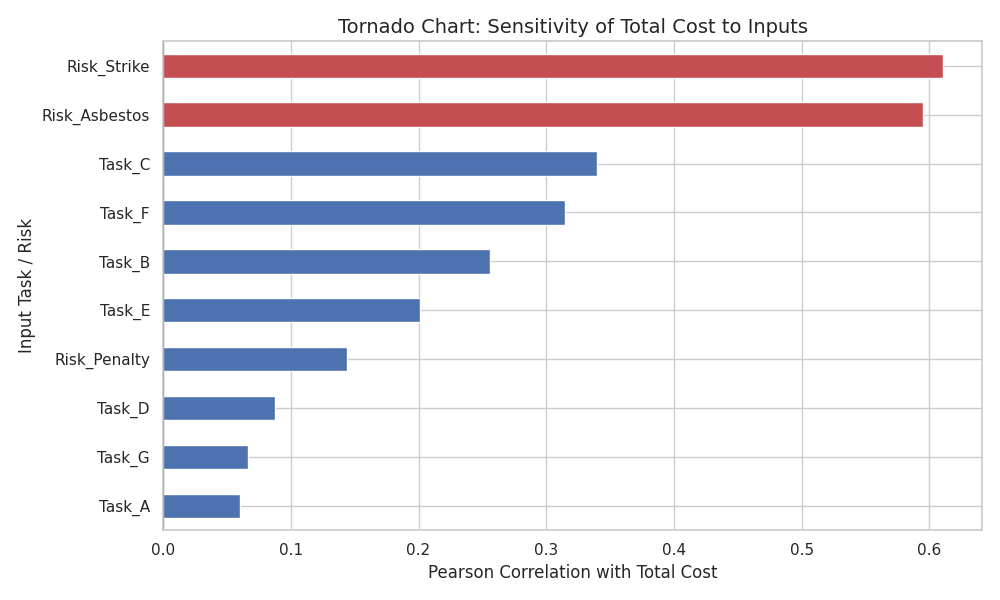

## Project 1: Budget Modelling with Monte Carlo 

This Budgeting Project builds on the following prerequisites:

### Labs for Project 1

- {ref}`lab-1`
- {ref}`lab-2`
- {ref}`lab-3`

### Mandatory Chapters for Project 1

- {ref}`sec:prob_stats`
- {ref}`sec:monte_carlo_method`

### Recommended Chapters for Project 1

- {ref}`sec:building_simulation_models`
- {ref}`sec:random_number_generation`

## Budget Modelling Context and Information

This project is based on
[Zhijing Eu's Project]https://medium.com/analytics-vidhya/building-a-probabilistic-risk-estimate-using-monte-carlo-simulations-cf904b1ab503 
with some modifications to make it into a project for this book.

You are a consultant for True Risk Solutions, a boutique analytics firm in Seattle.
Your client, a large infrastructure developer named Bygg & Bo, is preparing a
bid for a massive renovation of the Seattle's harbor district. They are nervous about cost overruns,
which have plagued their previous projects.

The client provided the following information during your kickoff meeting on February 12th.
They have broken the project down into 12 major work packages (tasks).
However, because of the uncertain nature of renovation work
 (e.g., finding old pipes, weather delays, permit issues),
 they cannot give you a single fixed cost for each task.

Instead, their project managers have provided 3-point estimates
(Optimistic, Most Likely, and Pessimistic costs) for each task in thousands of United States Dollars (USD).
They are relying on you to aggregate these uncertainties into a robust total budget estimate.

Additionally, unlike their previous small projects, this renovation is fraught with uncertainty.
The client is worried about three distinct types of variability:

- Estimation Uncertainty: The standard variance in how long tasks take.
- Risk Events: Specific disasters that might happen (e.g., finding asbestos) or might not.
- Market Correlation: The fear that if material prices go up, they will go up for all tasks simultaneously, increasing the risk of a perfect storm of cost overruns.

Your supervisor, Dr. Rademacher, has outlined the input parameters below and needs you to
build a Python-based or XL-Risk Monte Carlo simulation model (10,000 trials) to estimate
the Total Project Cost.

```{table}
| Task Name | Description | Distribution Type | Parameters (kUSD) | Notes |
| :--- | :--- | :--- | :--- | :--- |
| **A** | Site Survey | **Uniform** | $a = 40, b = 80$ | Little history, just a known range. |
| **B** | Demolition | **Triangular** | $L = 100, M = 150, H = 300$ | Standard 3-point estimate. |
| **C** | Concrete Work | **Normal** | $\mu = 300, \sigma = 40$ | Good historical data available. |
| **D** | Electrical | **Triangular** | $L = 80, M = 110, H = 160$ | |
| **E** | Plumbing | **Uniform** | $a = 90, b = 210$ | Highly uncertain range. |
| **F** | HVAC | **Normal** | $\mu = 200, \sigma = 30$ | |
| **G** | Interior | **Triangular** | $L = 70, M = 90, H = 120$ | |
```

### Phase 2: The "Risk Register" (Discrete Events)

In addition to the base costs above, there are specific Risk Events.
For each iteration of your simulation, you must simulate whether these events occur (Bernoulli trial).
If an event occurs, you must then simulate its cost impact and add it to the total.

```{table}
| Event ID | Risk Description | Probability of Occurrence | Impact Cost Distribution (If it occurs) |
| :--- | :--- | :--- | :--- |
| **R1** | **Asbestos Discovery** | **30%** | **Normal** $(\mu = 200, \sigma = 50)$ kNOK |
| **R2** | **Labor Strike** | **10%** | **Uniform** $(a = 100, b = 500)$ kNOK |
| **R3** | **Permit Penalty** | **50%** | **Fixed** $50$ kNOK |
```

### Phrase 3: Correlated Variables: Market Pricing

The client knows that the costs for Task C (Concrete) and Task F (HVAC)
are sensitive to the global price of commodities.

- If commodities are expensive, both C and F will likely be on the higher end of their distributions.
- If commodities are cheap, both will likely be cheaper.

Modeling Instruction: To model this correlation without complex matrix math, Dr. Rademacher
wants you to implement a Market Factor (M):

- Generate a standard normal variable $M \sim N(0,1)$.
- Define the cost of Task C and Task F as dependent on M:

 - $Cost_C $​=$\mu_C ​+ \sigma_C​ \cdot [\rho \cdot M+\sqrt{1−\rho^2​} \cdot Z_C​]$
 - $Cost_F​$=$\mu_F ​+ \sigma_F​ \cdot [\rho \cdot M+\sqrt{1−\rho^2} \cdot ​Z_F​]$

Where $\rho=0.7$ (correlation strength), and $Z_C​,Z_F​$ are independent standard normal variables.

## Metrics & Deliverables

The client needs to understand the Tail Risks in report and software form. Calculate the following based on 10,000 replications using Python or XLRisk and write a report on the topic:

- The Perfect Storm Probability: What is the probability that Risk $R_1$ (Asbestos) occurs and the Total Project Cost exceeds 1,800 USD?

### Impact of Correlation

Run the simulation twice:

- Scenario A: With the Correlation ($ \rho = 0.7$) applied to Tasks C & F.
- Scenario B: Assuming Tasks C & F are fully independent ($\rho=0$).

Compare the Standard Deviation of the Total Cost for both scenarios. (Dr. Rademacher expects Scenario A to have a wider spread).

### VaR and CVaR (Value at Risk)

- Calculate the Value at Risk (95%): The cost threshold that we will not exceed with 95% confidence.

- Calculate the Conditional Value at Risk (95%): If we breach the 95% threshold (the worst 5% of cases), what is the average cost of those bad cases?

### Visual Deliverables

- Overlay Histogram: Plot the distribution of Total Cost for Scenario A (Correlated) vs Scenario B (Uncorrelated) on the same graph to visualize how correlation flattens the curve and extends the tails.

- Tornado Chart: A bar chart showing which input (Task C, Task B, Risk R1, etc.) has the highest correlation with the Total Project Cost, helping the client identify which risk to focus on.

## Project 1, Model Example Output




```{code}
----------------------------------------
EXAMPLE RISK SOLUTIONS - ANALYSIS OUTPUT
----------------------------------------
1. Perfect Storm Probability (Asbestos & >1800k): 0.46%
2. Standard Deviation Comparison:
   - With Correlation:    165.99 kUSD
   - Without Correlation: 158.98 kUSD
   - Impact: Correlation increased risk spread by 7.01 kUSD
3. Tail Risk Metrics (Scenario A):
   - Value at Risk (95%): 1535.37 kUSD
   - CVaR (Avg cost of worst 5%): 1654.36 kUSD
----------------------------------------
```


