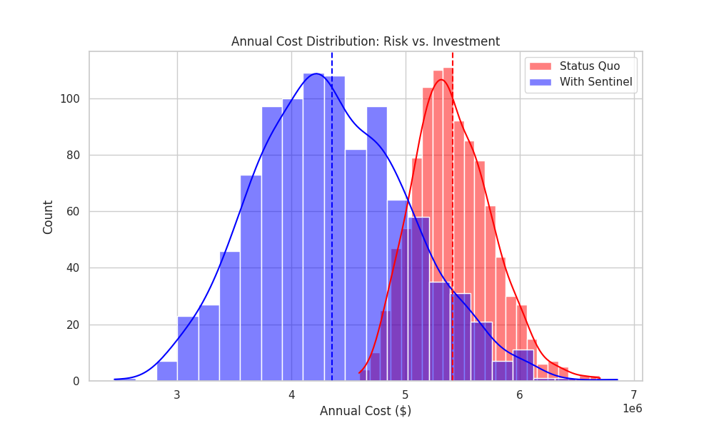

(project-2)=
# Project 2 (Fundamental Project): Using Monte Carlo for Cyber Risk

This project focuses on developing the following skills:

1. How to structure \& create a simulation study;
2. Learning how to use Monte Carlo Methods to build basic simulations;
3. Comparative Analysis between alternative solutions and configurations.

## Project 2 Prerequisites

This Cyber Risk Analysis Project builds on the following prerequisites:

### Labs for Project 2

- {ref}`lab-1`
- {ref}`lab-2`
- {ref}`lab-3`

### Mandatory Chapters for Project 2

- {ref}`sec:prob_stats`
- {ref}`sec:monte_carlo_method`

### Recommended Chapters for Project 2

- {ref}`sec:building_simulation_models`
- {ref}`sec:random_number_generation`

## Risk Modelling Context and Information

You are a junior analyst at Sandy Cyber Defense, a specialized consultancy in Alberta.
Your client is AQ Bank, a regional bank that is digitizing its operations.
The bank's CTO is worried about the rising tide of cyberattacks and is considering purchasing an
expensive AI-driven security suite called Sentinel.

However, the CFO refuses to approve the budget unless you can substantiate
that the potential losses from cyberattacks exceed the cost of the software.

They have provided you with data for their current operations and the projected impact of the
new software. They need you to simulate a full operational year (365 days)
1,000 times to determine if the investment makes sense.

### Status Quo

The bank faces two distinct types of threats. You must model the
Daily Occurrence (Frequency) and the Cost per Incident (Severity) for each.

#### Threat A: Phishing

Frequency: The bank receives roughly 100 suspicious emails a day.
The probability of an employee clicking and causing a breach
can be approximated as a Binomial Distribution ($n=100, p=0.04$).

Severity: If a breach occurs, the cost (cleanup, password resets, minor fraud)
follows a PERT Distribution:

- Optimistic: $500
- Most Likely: $3,000
- Pessimistic: $8,000

However, there is a small binomially defined (p = 0.02) possibility that the attacker implant malware
on to the network, which has double the costs of a normal phishing operation:

- Optimistic: $1,000
- Most Likely: $6,000
- Pessimistic: $16,000

#### Threat B: Ransomware Attack

Frequency: This is a rare but devastating event. The probability of a successful Ransomware attack on any given day is low ($p=0.005$, or 0.5%).

Severity: If this happens, the costs are massive (data recovery, legal fees, PR crisis).
 Experts model this as a Triangular Distribution:

- Low: $50,000
- Mode: $150,000
- High: $500,000

### Sentinel Mitigation

The "Sentinel" software promises to reduce the probability of attacks succeeding,
but it comes with its own implementation costs
and downsides as attackers will know that you have valuable information increasing the
risk of a randomware attack.

- Implementation Cost: The vendor quotes 150,000 dollars yearly for the systems=
but implementation often goes over budget.
Model the annual cost of the software as a Uniform Distribution between 140,000 and 180,000
dollars.

- Effectiveness: It reduces the Phishing success probability ($p$) from 0.04 to 0.005.
It increases the Ransomware daily probability ($p$) from 0.005 to 0.02.

## Metrics for Project 2

Your firm's Lead Data Scientist, Dr. Lovelace, has
sketched out the analysis she wants you to perform.
She warns you that "Averages hide the risk" and
wants you to focus on the tails of the distribution.

```{raw} latex
\begin{enumerate}
    \item \textbf{Annual Loss Exposure (ALE):}
    Simulate 1,000 years of operation for the Status Quo. Calculate the Average Annual Loss and the 95\% Value at Risk (VaR). (The 95\% VaR is the loss amount that will not be exceeded in 95\% of years).

    \item \textbf{The ``Sentinel'' Simulation:}
    Simulate 1,000 years of operation With Sentinel (incorporating the reduced probabilities AND the cost of the software). Calculate the new average Annual Total Cost (Losses + Software Cost).

    \item \textbf{Return on Security Investment (ROSI):}
    For each of the 1,000 simulations, calculate the savings:
    \[ \text{Savings} = (\text{Status Quo Loss}) - (\text{Sentinel Loss} + \text{Sentinel Cost}) \]
    What is the probability that the savings are positive? (i.e., How often does the software pay for itself?)

    \item \textbf{Visual Deliverables:}
    \begin{itemize}
        \item \textbf{Overlaid Histograms:} Plot the distribution of Total Annual Costs for ``Status Quo'' vs. ``With Sentinel''.
        \item \textbf{Convergence Plot:} Plot the rolling average of the ``Status Quo'' Annual Loss as the number of simulations increases from 1 to 1,000.
    \end{itemize}
\end{enumerate}
```

## Project 2, Model Example Output

```{code}
Status Quo ALE: $5,415,101.67
Status Quo 95% VaR: $6,007,254.17
Sentinel ALE (Total): $4,358,240.06
Probability of Positive ROI: 91.8%
```

### Example Graph of Output

