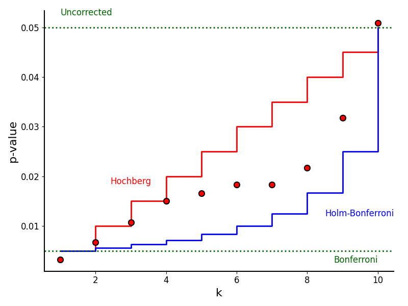

# On Making Multiple Comparisons (Bonferroni)

A significant issue in statistical analysis is the [multiple comparisons problem](https://en.wikipedia.org/wiki/Multiple_comparisons_problem).
This occurs when a set of statistical inferences is considered
simultaneously or when multiple tests are performed on the same data set.
This issue is critical in both hypothesis testing and the construction of confidence intervals.

The core problem is that as the number of tests increases, the probability of observing at least
one significant result purely by chance (a false positive) increases. If we perform m independent
tests, each with a significance level α, the probability of making at least one Type I error is:

```{math}
P(\text{at least one error})= 1−(1−\alpha)^m
```

## Family-Wise Error Rate (FWER)

The Family-Wise Error Rate (FWER) is the probability of making one or more false discoveries
(Type I errors) among all the hypotheses when performing multiple tests. Corrective methods aim to
control the FWER at a desired level (e.g., $\alpha=0.05$).

Controlling the FWER makes the series of tests more conservative, ensuring that the overall
confidence in the set of conclusions is maintained.

### The Bonferroni Correction

The theoretical basis for the Bonferroni correction is Bonferroni's Inequality
(also known as the Union Bound or Boole's Inequality).

:::{prf:theorem}[Bonferroni's Inequality]
For any set of events $E_1, E_2, \dots, E_m$, the probability that at least
one of the events occurs is no greater than the sum of their individual probabilities:
\begin{equation}
    P\left( \bigcup_{i=1}^m E_i \right) \le \sum_{i=1}^m P(E_i)
\end{equation}
:::

We can apply this to our FWER through the following link.
Let $E_i$ be the event that the individual hypothesis test $i$
results in a Type I error (a false positive).
We want to ensure that the total FWER (the probability of the
union of these errors) is at most $\alpha$.

\begin{equation}
    \text{FWER} = P\left( \bigcup_{i=1}^m E_i \right) \le \sum_{i=1}^m P(E_i)
\end{equation}

If we set the significance level for each individual test to $\gamma_i = \alpha/m$, then $P(E_i) = \alpha/m$.
Substituting this into the inequality:

\begin{equation}
    \text{FWER} \le \sum_{i=1}^m \frac{\alpha}{m} = m \cdot \frac{\alpha}{m} = \alpha
\end{equation}

This proves that determining significance using $\alpha/m$ guarantees the
overall error rate will not exceed $\alpha$, regardless of the dependence
structure between tests.

The Bonferroni correction is the most straightforward method to control the FWER.
It adjusts the significance level of each individual test so that the sum of the probabilities of a
Type I error for each test is less than or equal to the desired overall $\alpha$.

The Bonferroni correction is a method to reduce the [family-wise error rate](https://en.wikipedia.org/wiki/Family-wise_error_rate)
(FWER) when doing multiple comparisons. The FWER refers to the probability of making one or more
false positives when performing multiple hypothesis tests
A statistical way of saying this is that it makes the series of tests more _conservative_, and that
they maintain their significance level.

:::{prf:definition} Bonferroni Correction
:label: bonferroni-correction
Let $m>0$ be an integer representing the number of hypotheses. Then let $\alpha_i$
represent the significance level for test $i$, and $\gamma_i$ represent the adjusted
significance level for test i. And let $\beta$ represent the overall
significance level. When written in this form:
\begin{equation}
  \gamma_i = \frac{\alpha_i}{m};
\end{equation}
it represents the significance level for each individual test, allowing
for the maintenance of $\beta$ across the family of tests when $\gamma_i$
replaces $\alpha_i$.

\begin{equation}
\beta = 1 - (1-\alpha_i)^m \rightarrow \beta = 1 - (1-\gamma_i)^m
\end{equation}
:::

#### Pros and Cons

Pros: Simple to calculate; universally applicable (does not require independence between tests).

Cons: Highly conservative; as m becomes large, the power of the test
(probability of detecting a true effect) drops dramatically, leading to
a high rate of Type II errors (false negatives).

## An Example of Bonferroni Against Other Methods


```{code}
                              FWER  Avg Power
Uncorrected                  0.888     0.8510
Bonferroni                   0.043     0.3984
Holm-Bonferroni (Step-Down)  0.045     0.4008
Simes-Hochberg (Step-Up)     0.045     0.4008
```

## Holm-Bonferroni method

While Bonferroni is simple, it is often too conservative.
Other methods can control the FWER while retaining more statistical power.

The Holm-Bonferroni method is a sequential procedure that is uniformly
more powerful than the standard Bonferroni correction while still controlling the
FWER. It does not assume independence between tests.

```{raw} latex
\textbf{Procedure:}
\begin{enumerate}
    \item Calculate the $p$-values for all $m$ tests.
    \item Sort the $p$-values in ascending order: $p_{(1)} \le p_{(2)} \le \dots \le p_{(m)}$.
    \item Compare each $p_{(i)}$ to an adjusted $\alpha$ that changes based on its rank:
    \begin{equation}
        \text{Reject } H_{(i)} \text{ if } p_{(i)} \le \frac{\alpha}{m - i + 1}
    \end{equation}
    \item Step down through the sorted values (from smallest $p$ to largest). Stop at the first index $k$ where the inequality does \textit{not} hold.
    \item Reject all null hypotheses $H_{(1)} \dots H_{(k-1)}$ and fail to reject $H_{(k)} \dots H_{(m)}$.
\end{enumerate}
```

## Hochberg's Step-Up Procedure

A step-up procedure that is generally more powerful than Holm's method. It works by examining the largest $p$-values first.

```{raw} latex
\begin{enumerate}
    \item Sort $p$-values in ascending order.
    \item Start testing from the largest $p$-value $p_{(m)}$.
    \item If $p_{(m)} \le \alpha$, reject all hypotheses.
    \item If not, check if $p_{(m-1)} \le \alpha/2$, and so on.
    \item The cutoff is the largest $i$ such that $p_{(i)} \le \frac{\alpha}{m-i+1}$. All hypotheses $H_{(1)} \dots H_{(i)}$ are rejected.
\end{enumerate}
\textit{(Note: This requires certain dependence structures, though it is often valid for common test statistics.)}
```