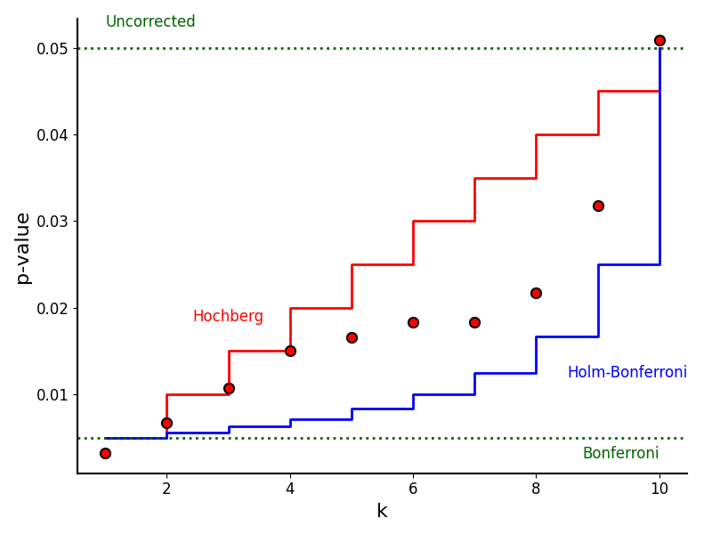

# On Making Multiple Comparisons in Output Analysis

In simulation and systems engineering, we rarely make a single estimation (a type of inference in statistical terms). Whether you are comparing $m$ different system configurations or constructing simultaneous confidence intervals for multiple performance measures (e.g., throughput, wait time, and queue length), you face the [multiple comparisons problem](https://en.wikipedia.org/wiki/Multiple_comparisons_problem).

For example, when constructing a confidence interval for a single parameter, we are 95 percent sure
that the confidence interval contains the value of the parameter. However, if we construct $m$
such confidence interval, the probability that they will have coverage (the probability that the confidence
interval includes the value of the parameter) will be less than $1 - \alpha$.

For example, if we have $m = 10$ confidence intervals with a $\alpha = 0.05$,
then the probability of type I error (meaning that an
interval does not cover its parameter) can be defined as:

```{math}
P(\text{at least one error})= 1−(1−\alpha)^m \rightarrow 40 \% 
```

This applies to any uncorrected multiple comparison problem,
even if the experiments are independent of each other. And the rate
of this type I error is called the Family Wise Error Rate (FWER).

## Family-Wise Error Rate (FWER)

A more formal defintion of The [Family-Wise Error Rate](https://en.wikipedia.org/wiki/Family-wise_error_rate)
is that it represents the probability of making one or more false discoveries
(Type I errors) among all the hypotheses when performing multiple tests. Corrective methods aim to
control the FWER like Bonferroni at a desired level (e.g., $\alpha=0.05$).

Controlling the FWER makes the series of tests more conservative (meaning that the test will always
keep the probability of rejecting the null hypothesis below or equal to the confidence level),
maintaining that the overall confidence in the set of conclusion.

## The Bonferroni Correction

One method to reduce the impact of the FWER is the Bonferroni Correction.

:::{prf:definition} Bonferroni Correction
:label: bonferroni-correction
Let $m>0$ be an integer representing the number of hypotheses. Then let $\alpha_i$
represent the significance level for test $i$, and $\gamma_i$ represent the adjusted
significance level for test i. And let $\beta$ represent the overall
significance level. When written in this form:
\begin{equation}
  \gamma_i = \frac{\alpha_i}{m};
\end{equation}
it represents the significance level for each individual test, allowing
for the maintenance of $\beta$ across the family of tests when $\gamma_i$
replaces $\alpha_i$.

\begin{equation}
\beta = 1 - (1-\alpha_i)^m \rightarrow \beta = 1 - (1-\gamma_i)^m
\end{equation}
:::

Now, the following set of examples shows how Bonferroni intuitively works
on simultaneous confidence intervals and hypothesis testing, important methods
in output analysis.

:::{prf:example} Simultaneous Confidence Intervals
When conducting a simulation study to compare $k$ different policies
for an industrial system, we want to be $1−\alpha$ confident that all
$k$ confidence intervals simultaneously contain their respective
means $\mu_i$​.

If we were to use a standard $95\%$ confidence interval for each of
the 3 policies, our actual family-wise confidence level would drop
significantly—potentially as low as $(1−0.05) * 3 \approx 85.7%$.

```{raw} latex
To maintain the Family-Wise Error Rate (FWER), we apply the Bonferroni adjustment to the significance level used for each individual interval:

\begin{itemize}
    \item \textbf{Target FWER ($\alpha$):} $0.05$
    \item \textbf{Adjusted Significance ($\alpha/k$):} $0.05 / 3 \approx 0.01667$
    \item \textbf{Degrees of Freedom ($df$):} $n - 1 = 14$
    \item \textbf{Critical Value Calculation:} We seek the $t$-score corresponding to the upper tail probability of $1 - \frac{\alpha}{2k}$.
    \[
    t_{n-1, 1-\frac{\alpha}{2k}} = t_{14, 1-\frac{0.05}{2 \cdot 3}} = t_{14, 0.99167}
    \]
\end{itemize}

Comparing the standard vs. adjusted critical values for $df=14$:
\begin{itemize}
    \item Standard Critical Value: $t_{14, 0.975} \approx 2.145$
    \item Bonferroni Adjusted Value $t_{14, 0.99167} \approx 2.718$
\end{itemize}
```

```{raw} latex
\begin{table}[h]
\centering
\begin{tabular}{@{}lcccc@{}}
\textbf{Policy} & $\bar{X}_i$ & $S_i/\sqrt{n}$ & \textbf{Individual Calculation} & \textbf{Simultaneous 95\% CI} \\ \midrule
Policy 1 & 450 & 12 & $450 \pm (2.718 \cdot 12)$ & $[417.38, 482.62]$ \\
Policy 2 & 410 & 10 & $410 \pm (2.718 \cdot 10)$ & $[382.82, 437.18]$ \\
Policy 3 & 480 & 15 & $480 \pm (2.718 \cdot 15)$ & $[439.23, 520.77]$ \\
\end{tabular}
\caption{Comparison of inventory policies using Bonferroni-adjusted confidence intervals.}
\end{table}


With a simultaneous confidence level of 95\%, we observe that Policy
2 and Policy 3 have non-overlapping intervals, indicating a
statistically significant difference in their mean performance.
However, Policy 1 overlaps with both, suggesting insufficient
evidence to distinguish it from the others under this conservative
correction.
```

:::

:::{prf:example} Independent Tests
Suppose 250 independent tests are performed, and we have chosen a false-
positive probability of $\alpha = 0.025$ for each. Suppose we observe 12 significant tests by
these criteria. Is this number greater than expected by chance?
Here, $n \alpha = 250 \cdot 0.025 = 6.25$

The probability of observing 12 (or more) significant tests is calculated using the Binomial distribution:

$$ \sum_{k=12}^{250} \text{Pr}(k \text{ false positives}) = \sum_{k=12}^{250} \binom{250}{k} (1 - 0.025)^{250-k} (0.025)^k $$

Evaluating this sum yields a probability of approximately 0.0225.
Since this is less than $0.05$ (or our specific $\alpha$),
we might conclude the result is unlikely by chance, yet the
risk of at least _one_ false positive across all tests remains high.

When we apply the Bonferroni correction, we adjust the significance threshold per comparison
$\alpha_{\text{local}}$ so that the FWER does not exceed $\alpha$. In this case, the adjustment
is:

$$
\alpha_{local} = \frac{0.025}{250} = 0.0001
$$

In this corrected framework, an individual test is only considered statistically significant if $p < 0.0001$.
Consequently, the 12 tests previously labeled as "significant" must be re-evaluated; any test with
$0.0001 \leq p < 0.025$ is now considered a likely false positive.
:::

The theoretical basis for the Bonferroni correction is Bonferroni's Inequality
(also known as the Union Bound or Boole's Inequality).

:::{prf:theorem} Bonferroni's Inequality 
For any set of events $E_1, E_2, \dots, E_m$, the probability that at least
one of the events occurs is no greater than the sum of their individual probabilities:
\begin{equation}
    P\left( \bigcup_{i=1}^m E_i \right) \le \sum_{i=1}^m P(E_i)
\end{equation}
:::

We can apply this to our FWER through the following link.
Let $E_i$ be the event that the individual hypothesis test $i$
results in a Type I error (a false positive).
We want to ensure that the total FWER (the probability of the
union of these errors) is at most $\alpha$.

\begin{equation}
    \text{FWER} = P\left( \bigcup_{i=1}^m E_i \right) \le \sum_{i=1}^m P(E_i)
\end{equation}

If we set the significance level for each individual test to
$\gamma_i = \alpha/m$, then $P(E_i) = \alpha/m$.

Substituting this into the inequality:

\begin{equation}
    \text{FWER} \le \sum_{i=1}^m \frac{\alpha}{m} = m \cdot \frac{\alpha}{m} = \alpha
\end{equation}

This proves that determining significance using $\alpha/m$ guarantees the
overall error rate will not exceed $\alpha$, regardless of the dependence
structure between tests.

The Bonferroni correction is the simplest method to control the FWER.
It adjusts the significance level of each individual test so that the sum of the probabilities of a
Type I error for each test is less than or equal to the desired overall $\alpha$.

### Pros and Cons

Pros: Simple to calculate; universally applicable (does not require independence between tests).

Cons: Highly conservative; as m becomes large, the power of the test
(probability of detecting a true effect) drops dramatically, leading to
a high rate of Type II errors (false negatives).

## Holm-Bonferroni method

A more advanced method improves upon Bonferroni's correction. By making it less
_conservative_. This might be useful if you are performing a series of confidence intervals
or hypothesis testing on a several system configurations.

The Intuition: Instead of applying the harshest penalty ($\alpha/m$) to every test,
we apply it only to the largest significant result (highest p-value).
As we reject null hypotheses, we gradually relax the penalty for the remaining tests.

```{raw} latex
\textbf{Procedure:}
\begin{enumerate}
    \item Rank: Sort p-values $p(1)​\le p(2)​\le ... p(m)$​.
    \item Test: Compare each p(i)​ to $\frac{\alpha}{m−i+1}​$.
    \item Stop: The moment a p-value exceeds its threshold, stop and fail to reject all remaining hypotheses.
\end{enumerate}
```

:::{prf:example} Holm-Bonferroni Example
Construct confidence intervals for $m=3$ system designs such that we are $95\%$ confident ($\alpha=0.05$) that **all** intervals correctly contain the true mean difference from the baseline.

We run simulations for each design and calculate the standard error for the difference.
We use the Holm step-down logic to determine the adjusted $\alpha$ for each interval:

* **Comparison 1 (Design A):** Largest observed difference.
* **Comparison 2 (Design B):** Second largest difference.
* **Comparison 3 (Design C):** Smallest observed difference.

| Comparison | Configuration | Indiv. $\alpha$ Hurdle | Adjusted Confidence Level | Required to Continue |
| :--- | :--- | :--- | :--- | :--- |
| 1 | Design A | $\alpha/3 = 0.0167$ | $98.33\%$ | Interval must NOT contain 0 |
| 2 | Design B | $\alpha/2 = 0.0250$ | $97.50\%$ | Interval must NOT contain 0 |
| 3 | Design C | $\alpha/1 = 0.0500$ | $95.00\%$ | Interval must NOT contain 0 |

* **Step 1:** We build a $98.33\%$ CI for Design A. If it **excludes zero**, Design A is significantly different, and we move to Step 2.
* **Step 2:** We build a $97.5\%$ CI for Design B. If it **excludes zero**, we move to Step 3.
* **Step 3:** If at any point an interval **includes zero**, the procedure stops. All remaining designs (and the current one) are considered not significantly different from the baseline at the joint $95\%$ level.

In the classical Bonferroni method,
**all three** intervals would be forced to a $98.33\%$ confidence level. The
Holm approach allows the later intervals to be **narrower** (97.5% and 95%), making it easier to detect
improvements in system performance due to a larger effect size and lower type II error rate than Bonferroni.
:::

### An Graphical Example of Bonferroni Against Other Methods


```{code}
                              FWER  Avg Power
Uncorrected                  0.888     0.8510
Bonferroni                   0.043     0.3984
Holm-Bonferroni (Step-Down)  0.045     0.4008
Simes-Hochberg (Step-Up)     0.045     0.4008
```
