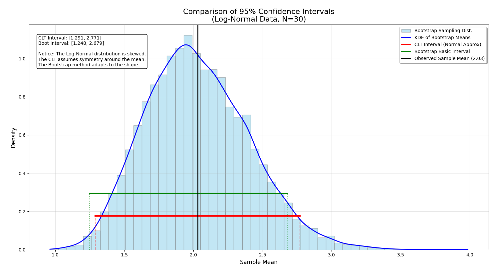

# Confidence Intervals

It is highly likely that you have done some form of statistics course
or at least reviewed the first chapter {ref}`sec:prob_stats`. And therefore
have heard the idea of a confidence interval before, most likely with a
definition similar to: "A confidence interval (CI) is a range of values,
calculated from sample data, that is likely to contain an unknown
population parameter (i.e. location or scale parameter)" and that
the confidence level represents the reliability of the method used to
calculate this estimate in frequentist statistics.

## The Classical Central Limit Theorem

When estimating the mean using $\bar{X}$,
we rely on the Central Limit Theorem (CLT).

Central Limit Theorem: Let $X_1, X_2, ... X_n$
be a sequence of IID random variables with finite mean $\mu$ and a finite, non-negative, standard deviation, and let $Z_n$ be the random variable:

$$Z_n = (\bar{X} - \mu) / \sqrt{\frac{\sigma^2} {n}}.$$

Then asymptotically:

$$\text{Pr}(X_{n} \le z) = F_{n,Z}(z) \rightarrow \psi(z)$$

Where $\psi$ represents the CDF of the standard normal, $N(0,1)$.

However, for practicable purposes, we need to find $\mu$ and a guarantee
of the quality of the estimate. This is where
confidence intervals come into the picture as we need to determine values that bound the estimate of the mean within a prescribed probability.

Now that we have $Z_n$ with an unknown $\sigma^2$, we have to construct a random
variable $t_n$ and estimator $S^2(n)$ in:

$$t_n = (\bar{X}(n) - \mu) / \sqrt{S^2(n) / n}$$

Which by the Classic CLT, asymptotically converges into $\psi$, and allowing for a approximation defined through:

\begin{align*}
 \Pr\Bigl(
 & -z_{1-\alpha/2} \le (\bar{X}(n) - \mu)/\sqrt{S^2(n)/n} \le z_{1-\alpha/2}
  \Bigr)
  \\
&=
\Pr\left(
\bar{X}(n) -z_{1-\alpha/2}\sqrt{S^2(n)/n}
\le - \mu
\le \bar{X}(n) + z_{1-\alpha/2}\sqrt{S^2(n)/n}
\right) \\
&\approx 1 - \alpha
\end{align*}

$\alpha$ is often called the significance level, and $z_{1-\alpha/2}\sqrt{S^2(n)/n}$ is the half length of the convergence interval.

## What is a Confidence Interval, Really?

A confidence interval defines a probabilistic guarantee that a parameter
will reside within an interval, and this probability level is
provided by percentage of intervals that contain $\mu$ also
known as _coverage_. And if the underlying
distribution is IID with finite variance, it will assume the form:

$$\bar{X}(n) \pm Z_{1-a/2} \sqrt{S^2(n)/n}$$

The problem with this asymptotic convergence
is the "$n$ is sufficiently large" problem
because of two facts:

1) The more skewed $X_i$ are, the larger
n has to be, and the rate of convergence could
become infinity.

2) The fact that heavy tails exist, making it
impossible for some distributions to converge
using Classical CLT and the Strong Law of Large Numbers.

:::{admonition} A Python Implementation
:class: dropdown

``` {code} python
def calculate_clt_interval(data, confidence=0.95):
    """
    Calculates the Confidence Interval using the Central Limit Theorem.
    
    Formula: Mean +/- Z * (Standard Deviation / sqrt(n))
    Assumes the sampling distribution of the mean is Normal.
    """
    n = len(data)
    sample_mean = np.mean(data)
    sample_std = np.std(data, ddof=1) # ddof=1 for sample standard deviation
    std_error = sample_std / np.sqrt(n)
    
    # Get the critical Z-score (e.g., 1.96 for 95%)
    z_score = stats.norm.ppf((1 + confidence) / 2)
    
    margin_of_error = z_score * std_error
    lower = sample_mean - margin_of_error
    upper = sample_mean + margin_of_error
    
    return (lower, upper), sample_mean
```

:::

### Willink Confidence Intervals

For the first problem, we can consider using
a Willink Confidence interval (WCI) to correct skewness, the third central moment
($\nu = \exp[(X-\mu)^3]/(\sigma^2)^{3/2}$).

In general, WCI is a modified frequentist approach designed to correct positive skewness
(i.e: the skewness found in Gamma, log-normal distributions) included coverage error by
incorporating the sample skewness into the calculation.

The WCI modifies the critical value used in the interval. Instead of using the
symmetric $t$-quantile directly, it transforms the quantile using a function $G(\cdot)$
that accounts for the third central moment (skewness).

The $(1-\alpha)$ in WCI is given by:

$$\left[ \bar{X} - G\left(t_{crit}\right)\sqrt{\frac{S^2}{n}}, \quad \bar{X} + G\left(t_{crit}\right)\sqrt{\frac{S^2}{n}} \right]$$

To construct this interval, several statistics must be computed from the sample data $X_1, X_2, \dots, X_n$:

1) Sample Moments, which involves calculating the sample mean ($\bar{X}$) and variance ($S^2$).
The method heavily relies on an unbiased-type estimator for the third central moment, denoted in the text as $\hat{\mu}_3$:
$$\hat{\mu}_3 = \frac{n}{(n-1)(n-1)} \sum_{i=1}^{n} (X_i - \bar{X})^3$$

2) The Skewness Parameter ($a$), The parameter $a$ represents a scaled measure of the skewness of the
sampling distribution of the mean. It normalizes the third moment against the variance and sample size:
$$a = \frac{\hat{\mu}_3}{6\sqrt{n}(S^2)^{3/2}}$$ 
If the data is perfectly symmetric, $\hat{\mu}_3 = 0$, which makes $a=0$.

3) The Transformation Function $G(r)$ This maps a value $r$ (usually the $t$-critical value)
to a new value that adjusts for the estimated skewness $a$.
$$G(r) = \frac{1 + 6a(r - a)^{1/3} - 1}{2a}$$

## What a Confidence Interval Is Not

To Bayesians, there is a second concept that is often confused with
the confidence interval, the Credible interval. This interval defines the
possibility of a parameter residing in set of numbers within a given region
in the context of a posterior distribution. This is the concept
most people popularly associate with a confidence interval.

Credible intervals can be calculating using the simulation-sampling technique
described as Markov Chain Monte Carlo, which is defined further in {ref}`sec:MCMC`.

## Alterative Methods of Confidence Interval Construction

### Bootstrapping Methods

Bootstrapping methods are a family of methods
that can assign a series of measures of accuracy (i.e: Confidence Intervals, Variance,
Bias, Power, and Hypothesis Testing) to sample estimates. without relying on CLT.
It will provide better results in cases where the CLT and LLN do not apply (i.e: no
closed-form expression for the distribution or with small sample sizes). And bootstrapped
confidence intervals with certain limits will be smaller or the same with
the same level of accuracy and error as the confidence intervals generated with CLT.

:::{prf:example} Bootstrapping vs CLT on a Log-Normal Distribution


With a small sample size, $n = 30$, and on a skewed distribution,
CLT-based confidence intervals tend to be greater than a bootstrapped
confidence interval because bootstrapped intervals asymptotically converge
faster than CLT-based confidence intervals.
:::

#### How Does Bootstrapping Work?

Naive Bootstrapping is a sampling method that
consists of the following method, which was defined by {cite}`Efron1979Bootstrap`:

Suppose you have access to an i.i.d. sample $\{x_i\}_{i=1}^n$ and you want to compute a
statistic $\theta$ using an estimator $\hat{\theta}$. You can approximate the
distribution of $\hat{\theta}$ by

```{raw} latex
\begin{enumerate}
    \item Sample $n$ observations with replacement from your sample $\{\hat{x}_i\}_{i=1}^n$
    \item Compute the estimator $\hat{\theta}$
    \item Repeat steps 1 and 2 a large number of times
\end{enumerate}
```

The distribution of $\hat{\theta}^{*}$ is a good approximation of the distribution of $\hat{\theta}$.

As it is a good approximation of $\hat{\theta}$, $\hat{\theta}^{*}$ can be used to construct a
confidence interval following the basic method procedure from {cite}`Davison_Hinkley_1997`:

```{raw} latex
\begin{enumerate}
    \item \textbf{Resampling Loop:} For $r = 1$ to $R$:
    \begin{enumerate}
        \item Generate a bootstrap sample $\mathbf{x}^*_r$ by sampling $n$ observations from $\mathbf{x}$ \textit{with replacement}.
        \item Compute the bootstrap replicate: $\hat{\theta}^*_r = s(\mathbf{x}^*_r)$.
    \end{enumerate}

    \item \textbf{Empirical Distribution:} Sort the $R$ replicates in ascending order:
    $$ \hat{\theta}^*_{(1)} \leq \hat{\theta}^*_{(2)} \leq \dots \leq \hat{\theta}^*_{(R)} $$

    \item \textbf{Quantile Identification:} Let $q_{\alpha}$ denote the $\alpha$-th quantile of the bootstrap distribution. For a $(1-\alpha)$ confidence interval, identify:
    \begin{itemize}
        \item Upper quantile: $q_{1-\alpha/2} \approx \hat{\theta}^*_{((R+1)(1-\alpha/2))}$
        \item Lower quantile: $q_{\alpha/2} \approx \hat{\theta}^*_{((R+1)\alpha/2)}$
    \end{itemize}

    \item \textbf{Interval Construction (The Pivotal Method):}
    The Basic Bootstrap Interval relies on the pivotal assumption that the distribution of $\hat{\theta}^* - \hat{\theta}$ approximates $\hat{\theta} - \theta$. This leads to the interval limits (L = lower, U = upper):
    $$ L = 2\hat{\theta} - q_{1-\alpha/2} $$
    $$ U = 2\hat{\theta} - q_{\alpha/2} $$
\end{enumerate}
```

Note: Why do we "flip" the quantiles?
The Basic Interval assumes that the distribution of the error in the bootstrap world approximates the distribution of the error in the real world:
$$(\hat{\theta} - \theta) \approx (\hat{\theta}^* - \hat{\theta})$$

If we want to find the upper limit for $\theta$, we look at the relationship:
$$\theta \approx \hat{\theta} - (\hat{\theta}^* - \hat{\theta})$$
$$\theta \approx 2\hat{\theta} - \hat{\theta}^*$$

To find the lower confidence limit ($L$), we must subtract the largest likely error (the upper quantile of the bootstrap distribution,
$q_{1-\alpha/2}$). To find the upper confidence limit ($U$), we subtract the smallest likely error (the lower quantile, $q_{\alpha/2}$).

A Python Implementation of this algorithm with default parameters is below:

:::{admonition} Python Implementation
:class: dropdown

```{code} python
def calculate_bootstrap_basic_interval(data, n_bootstraps=10000, confidence=0.95, seed=42):
    np.random.seed(seed)
    n = len(data)
    observed_mean = np.mean(data)
    
    # 1. Resample with replacement and calculate means
    bootstrap_means = np.empty(n_bootstraps)
    for i in range(n_bootstraps):
        resample = np.random.choice(data, size=n, replace=True)
        bootstrap_means[i] = np.mean(resample)
        
    # 2. Find the percentiles of the bootstrap distribution
    alpha = 1 - confidence
    lower_percentile = np.percentile(bootstrap_means, 100 * (alpha / 2))
    upper_percentile = np.percentile(bootstrap_means, 100 * (1 - alpha / 2))
    
    # 3. Apply the Basic Method formula
    # Note: This differs from the 'Percentile Method'. The Basic method
    # corrects for bias by pivoting around the observed mean.
    ci_lower = 2 * observed_mean - upper_percentile
    ci_upper = 2 * observed_mean - lower_percentile
    
    return (ci_lower, ci_upper), bootstrap_means
```

:::

#### Why not Bootstrap Everything?

Like other sampling methods, the naive bootstrap is particularly vulnerable to heavy tails.

There is a way to address this with the Bayesian Bootstrap, introduced by Rubin, 1981

## Questions for the Reader

:::{seealso} Problem 1 (Analytic Application: Machine Failure)
:::

:::{seealso} Problem 2 (Analytic Application: Machine Failure)
:::

:::{seealso} Problem 3 (Analytic Application: Machine Failure)
:::

:::{seealso} Problem 4 (Analytic Application: Machine Failure)
:::