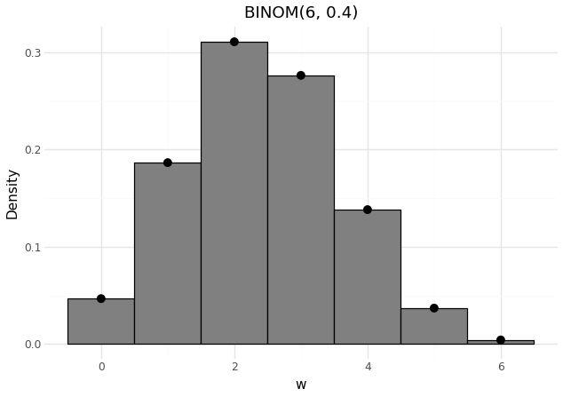

(sec:random_variates)=
# Generating Random Variates

In {ref}`sec:random_number_generation` we covered generating random
number from from the standard uniform distribution $U(0,1)$. In this
section we will see that once you are armed with this, you can
generate variates from a range of distributions. Here we will go
through four techniques for this:

- The Inverse Transform Method
- Composition
- Convolution
- Rejection sampling

:::{important} Why should you care about Random Variates?
Stochastic simulation methods, including Discrete Event Simulation and System Dynamics, depend on the generation of
random variates to model the stochaticity of real-world phenomena. A random variate such as the failure time of a
mechanical component or the arrival time of a customer is a realization of a random variable.
This value is typically produced by applying a transformation to a stream of uniform random numbers (drawn
from $U(0, 1)$).

Consequently, a proficient understanding of probability distributions and their associated variate
generation techniques is essential for the valid construction and interpretation of any stochastic model.
:::

(sec:inverse_transform_method)=
# The Inverse Transform Method

The setting is the following: we are given a univariate statistical
distribution with cumulative distribution function $F(x)$. The goal is
to generate variates (or sample) from this statistical
distribution. In the basic version we require that $F(x)$ is strictly
increasing for $0 < F(x) < 1$. We will later see how this can be
relaxed.

__Algorithm:__

  1. Generate $u$ from $U(0,1)$
  2. Return $x=F^{-1}(u)$

How do we know this is correct? What do we have to demonstrate? We
need to demonstrate that the random variable $X$ given by $F^{-1}(U)$
has CDF given by $F$.

\begin{align*}
 \Pr(X \le x) &= \Pr\bigl(F^{-1}(U) \le x \bigr)\\
	  &= \Pr\bigl(U \le F(x)\bigr) \\
	  &= F(x)\;.
\end{align*}

__Question:__ where was the monotonicity of $F$ used?

Is there any intuition behind the method?

Here are some examples of using the inverse transform method in
the continuous and discrete cases.

:::{prf:example} Exponential Distribution: Continuous
The Exponential Distribution has the CDF:

$$1-e^{\lambda \cdot x}, \text{ } x > 0$$

Solving $F(X) = U$ for $X$ gives us:

$$X = \frac{1}{\lambda} \cdot (-ln(1-U))$$

:::

:::{prf:example} Triangular Distribution: Discrete
The triangular distribution (0, 1, 2) has pdf:

$$f(x) =
\begin{cases}
    x       & \quad \text{if } 0 \leq x < 1 \\
    2-x     & \quad \text{if } 1 \leq x \leq 2.
\end{cases}$$

And the CDF:

$$F(x) =
\begin{cases}
    x^2/2     & \quad \text{if } 0 \leq x < 1 \\
    1 - (x-2)^2/2 & \quad \text{if } 1 \leq x \leq 2.
\end{cases}$$

If $U < \frac{1}{2}$, we solve $\frac{X^2}{2} = U$ to obtain

$$X = \sqrt{2U}$$

If $U \le \frac{1}{2}$, the root of $1-\frac{(X-2)^2}{2} = U$ in $[1, 2] is

$$X = 2 \sqrt{2(1-U)}$$
:::

(sec:composition_method)=
# The Composition Method

The composition method is a technique used to generate random variates from a target distribution $F(x)$ that can be
expressed as a mixture (or "composition") of several simpler (and ideally convex) component distributions.

And our target distribution must be able to be written in the form:

$$F(x) = \sum_i p_i \cdot F_i(x)$$

Where each $F_i(x)$ is a Cumulative Distribution Function (CDF) and $p_i$ represents the weights that
ensure $\sum_i P_i = 1$.

__Algorithm:__

  1. Generate a positive, random integer $I$ such that $P(I = i) = p_i$
  2. Return $X$ with CDF $F_i$ (given $I = i$, $X$ is independent of $I$).

The following proof demonstrates that the variate $X$ generated by the algorithm above
does converge into $F(x)$ when (2) is met when using the law of total probability and the
definition of a CDF.

:::{prf:proof} Composition Proof
:class: dropdown
For any fixed $x$,

```{math}
:label: Composition

P(X \le x) = \sum_{i} P(X \le x | I = i) \cdot P(I = i) \\

= P(X < x | I = i) \cdot  p_i\\

= \sum_{i} F_i(x) \cdot p_i \\

= F(x) \\
```

:::

__Question:__ The proof of the composition method above relies on the Law of Total Probability,
$F(x) = \sum_{i} F_i(x) p_i$. What property of the $p_i$ weights is necessary for $F(x)$ to be a valid Cumulative Distribution Function (CDF)?

:::{prf:example} Laplace Distribution
A classical example of the composition method is the Laplace distribution,
which is the composition between two exponential distributions reflected off
of the $y$-axis.

Let's define the exponential distribution using it's PDF and CDF:

$$ f(x) \equiv \begin{cases} \frac{1}{2}e^x, & x < 0 \\ \frac{1}{2}e^{-x}, & x > 0 \end{cases} \quad \text{and} \quad F(x) \equiv \begin{cases} \frac{1}{2}e^x, & x < 0 \\ 1-\frac{1}{2}e^{-x}, & x > 0 \end{cases}$$

Then decompose $X$ into negative and positive exponential distributions:
$$ F_1(x) \equiv \begin{cases} e^x & \text{if } x < 0 \\ 1 & \text{if } x > 0 \end{cases} \quad \text{and} \quad F_2(x) \equiv \begin{cases} 0 & \text{if } x < 0 \\ 1-e^{-x} & \text{if } x > 0 \end{cases} $$

Next, we need to sum them together (composition) with a 50-50 chance of sampling from either distribution.

$$F(x) = \frac{1}{2} F_1(x) + \frac{1}{2} F_2(x)$$

Equation 10 gives us two process that we need to do to use $F(x)$:

1) Generate a choice variable: Generate $U_1 \sim \text{Uniform}(0, 1)$.
2) Generate an inversion variable: Generate $U_2 \sim \text{Uniform}(0, 1)$.

We then apply the inverse transform method:
If $U_1 < 0.5$, We sample from $F_1$.

We solve $F_1(X) = U_2$:$$e^X = U_2 \implies X = \ln(U_2)$$

If $U_1 \ge 0.5$ (50\% chance): We sample from $F_2$. We solve $F_2(X) = U_2$:

$$1 - e^{-X} = U_2 \implies e^{-X} = 1 - U_2 \implies X = -\ln(1 - U_2)$$

Notice that if $U_2$ is a $\text{Uniform}(0, 1)$ variable, the term $1 - U_2$ is also distributed as a $\text{Uniform}(0, 1)$ variable. This means we can replace the $\ln(1 - U_2)$ term with $\ln(U_2)$ without changing the result.

This simplifies our algorithm to: If $U_1 < 0.5$: $X = \ln(U_2)$; otherwise, $U_1 \ge 0.5$: $X = -\ln(U_2)$.

$$X \leftarrow \begin{cases} \ln(U) & p = 1/2 \\ -\ln(U) & p = 1/2 \end{cases}$$
:::

(sec:convolution_method)=
# The Convolution Method

Convolutions are used when a random variable can be expressed as the sum
of two or more random variables, $Y_i$, and then this sum needs to be sampled as a random variate, $X$.
This is similar to the composition method, but expresses
the random variable as a sum of other random variates instead of the CDF as a weighted sum of other CDFs.

__Algorithm:__

  1. Generate $Y_1, Y_2, ... Y_m$ independently using their distribution
  2. Return $X = Y_1 + Y_2 + ... Y_m$

How do we use convolution?

:::{prf:example} Binomial as a Convolution of Bernoullis

A common use of convolution is hidden in of the most common
distributions, the binominal distribution. Fundamentally, all
binominal random variates are just a sum of i.i.d
Bernoulli random variates.

__Definition__: Let $W = \sum_{i=1}^n X_i$, where $X_i \sim Bernoulli(p)$. Then $W \sim \text{Binomial}(n, p)$.

We want to find the probability $P(W=k)$ for $k \in \{0, 1, ..., n\}$. $W=k$ means that exactly $k$ of the $X_i$ variables are equal to 1 and $n-k$ are equal to 0.

Consider one specific sequence of $k$ successes and $n-k$ failures (e.g., $k$ successes first, then $n-k$ failures).
Because all $X_i$ are independent, the probability of this single sequence is:

$$P(X_1=1, ..., X_k=1, X_{k+1}=0, ..., X_n=0) = p^k (1-p)^{n-k}$$

The total number of such arrangements is given by $\binom{n}{k}$.
Since each of these $\binom{n}{k}$ sequences is disjoint (a different outcome)
and has the same probability $p^k (1-p)^{n-k}$, the total probability $P(W=k)$ is the sum of their probabilities. Thus
$$P(W=k) = \binom{n}{k} p^k (1-p)^{n-k}$$

This is the exact Probability Mass Function (PMF) of a Binomial($n, p$) random variable. Thus, $W$ is binomially distributed.

And if you don't believe this result, we can also show a comparable result
using the Crude Monte Carlo method (CMC) to simulate a series of Bernoulli
Random Variates into a Binominal Random Variate, $W \sim Binominal(6, 0.4)$.



:::{admonition} Simulation Code
:class: dropdown

```{code} python
import numpy as np
import pandas as pd
from scipy.stats import binom
from plotnine import (ggplot, aes, geom_histogram, geom_point, theme_minimal, labs)

np.random.seed(2025)
n_samples = 1_000_000
x = np.random.binomial(5, 0.4, n_samples)
y = np.random.binomial(1, 0.4, n_samples)
w = x + y

print(f"Mean of x: {x.mean():.4f}") # 2.003
print(f"Mean of y: {y.mean():.4f}") # 0.3997
print(f"Mean of w: {w.mean():.4f}") # x + y = 2.4

df_w = pd.DataFrame({'w': w})
k = np.arange(7)
pdf = binom.pmf(k, 6, 0.4)
df_pdf = pd.DataFrame({'k': k, 'pdf': pdf})
hist_breaks = np.arange(-0.5, 7.5, 1)

p = (ggplot(df_w, aes(x='w'))
    + geom_histogram(
        aes(y='..density..'),
        breaks=hist_breaks,
        fill="gray",
        color="black"
    )
    + geom_point(
        data=df_pdf,
        mapping=aes(x='k', y='pdf'),
        color="black",
        size=3
    )
    + labs(
        title="BINOM(6, 0.4)",
        y="Density",
        x="w"
    )
    + theme_minimal()
)
p.show()
```

:::

:::

:::

(sec:rejection_sampling)=
# Rejection Sampling

Acceptance-rejection sampling is usually used when there is not a tractable, closed-form
expression for the target distribution's CDF $F(x)$. The goal is to generate variates $X$ from the density function $f
(x)$ of the target distribution. A requirement is that we must select a function $t(x)$ that _majorizes_ $f(x)$ for all
of $x$. However, t(x) is not a density, therefore, we need to set $c$ which is defined as $\int^{\infty}_{-\infty} t(x) dx \ge 1$,
and then define $d$ as a density that applies for all of $x$ as $d(x) = \frac{t(x)}{c}$.

__Algorithm:__

  1. Generate $Y$ having density d
  2. Generate $U$ from $U(0,1)$, independent of $Y$
  3. If $U \le \frac{f(Y)}{t(Y)}$, return $X = Y$ and stop (accept), else return to step 1 (reject)

The proof below shows how the algorithm given enough samples will converge into $f(x)$ using the
definition of conditional probabilities, law of total probability, calculus, and basic algebra.

:::{prf:proof} Long Proof: Rejection Sampling
:class: dropdown
This proof is based on the Rejection Sampling method from {cite:t}`liu2001monte`.

We get a $X$ conditional on acceptance from step 3, therefore, by the definition of conditional probabilities:

$$P(X \le x) = \frac{P(\text{acceptance}, Y \le x)}{P(\text{acceptance})}$$

And for any $y$:
$$P(\text{acceptance}| Y = y) = P(U \le \frac{f(y)}{t(y)}) = \frac{f(y)}{t(y)}$$

Because in step 2, we defined $U \sim U(0,1)$, and $Y$ is independent of $U$, and t(y) majorizes f(y), therefore:

```{math}
P(\text{acceptance, } Y \le x)= \int^{\infty}_{-\infty} P(\text{acceptance, } Y \le x| Y = y) \cdot r(y) dy
```

When then spilt this into the sum of two integration regions, the acceptance range and the rejection range
(aka what is below X and what is above X, respectively).

```{math}
\int^{X}_{-\infty} P(\text{acceptance, } Y \le x | Y = y) \cdot r(y) dy + \int^{\infty}_{X}P(\text{acceptance}, Y \le x | Y = y) \cdot r(y) dy
```

Which then simplifies into

$$\int^{X}_{-\infty} P(\text{acceptance}, Y \le x | Y = y) \cdot r(y) dy$$

And once we substitute in our definition of r(y)

$$\frac{1}{c} \int^{x}_{-\infty} t(y) dy$$

Which simplifies to

$$\frac{F(x)}{C}$$

However, we need to show how to reobtain $F(x)$, our original function from this simplification.
In this case, we can obtain $\frac{1}{c}$ from our probability of acceptance after substituting our
$r(y)$ and performing simplification.

$$P(\text{acceptance}) = \int^{\infty}_{-\infty} P(\text{acceptance}| Y = y) \cdot r(y) dy $$

Which becomes

$$\frac{1}{c} \int^{\infty}_{-\infty} \frac{f(y)}{t(y)} t(y) dy$$

Then we apply the multiplication of reciprocals (which always become 1), and simplify $\int^{\infty}_{-\infty} F(x)$
as one because it is a density, and therefore also equal to one, to get $\frac{1}{c}$.

Finally, we substitute our $P(\text{acceptance, } Y \le x)$ and $P(\text{acceptance})$ into the our definition of the
conditional probability, $\frac{P(\text{acceptance, } Y \le x)}{P(\text{acceptance})}$, giving us $F(x)$ through
algebraic manipulation.

$$\frac{F(x)/c}{1/c} \rightarrow F(x)$$
:::

__Question__: The method requires an "envelope" $c \cdot g(x)$ such that $f(x) \le c \cdot g(x)$. What property of the constant $c$ is essential for the acceptance probability $P(\text{acceptance})$ to be valid, and where in the proof is this used?

Now, how can we use rejection sampling?

:::{prf:example} Half-Normal Random Variable

This example is based off {cite}`ross2022simulation`. In this example, we
wish to generate a standard half-normal RV with PDF using rejection sampling:

$$f(x) = \frac{2}{\sqrt{2\pi}}e^{-x^2/2}, \quad x \geq 0.$$

Then we use the majorizing function:
$$t(x) = \sqrt{\frac{2e}{\pi}} e^{-x} \text{ } \forall x \text{ } \ge 0$$

When we calculate $c$, we take the integral of $t(x)$ upon x:
$$c = \sqrt{\frac{2e}{\pi}} \int_{0}^{\infty} e^{-x} dx \rightarrow  \sqrt{\frac{2e}{\pi}}  = 1.3155$$

Then we get the proposed density function $h(y)$ through dividing $t(y)$ over $c$:

$$h(y) \equiv \frac{t(y)}{c} = e^{-y}$$

And then we need $g(y)$, the ratio of $f(y)$ and $t(y)$, which represents the rejection ratio.
$$g(y) = \frac{f(y)}{t(y)} = e^{-\frac{(y-1)^2}{2}}$$

Once we have our functions, we can then apply the algorithm which allows us to have a random variate representing the half-normal r.v:

1) Generate $Y$ from the "proposed density" $h(y) = e^{-y}$.
2) Generate $U \sim \text{Uniform}(0, 1)$.
3) Accept/Reject: Check if $U \le g(Y)$, where $g(Y)$ is the ratio from Equation (32):

$$U \le e^{-\frac{(Y-1)^2}{2}}$$
if it passes, accept, return $X$ = $Y$; otherwise reject. Go back to step 1.
:::

# Problems Left to the Reader

:::{seealso} Problem 1 (Software Implementation of Random Variate)
Supposed that a Random Variable, $B$ has the following p.d.f:

$$f(x) = \begin{cases}
    0 & \text{if } x < 0 \text{ or } x > 2 \\
    x & \text{if } 0 \le x \le 1 \\
    \frac{1}{2} & \text{if } 1 \le x \le 2
\end{cases}$$

a) Use a method for generating realizations $B$ through any of the four methods, some are likely to
be easier than others.

b) Write code that implements the inverse transform method for this p.d.f.

c) How would you computationally verify that your simulation method is correct?

d) Compare the Inverse Transform method and the Rejection Sampling method for this specific p.d.f.
:::

:::{seealso} Problem 2 (Analytic Application: Machine Failure)
A machine is taken out of production either if it fails or after a period of 7 hours. By running
similar machines until failure, it has been found that time to failure, $F$, has the Weibull distribution with
$\alpha = 9, \beta = 0.55, \text{ and } \nu = 0$.

a) Write out a step-by-step procedure for generating the time, $X$, until the machine is out of production. _Hint_: This can be expressed through $X = min(F, 7)$.

b) Calculate the probability is the machine is taken out of production exactly at 7 hours, $P(X=7)$, then the expected time that machine is in production, $E[X]$.

c) Using Crude Monte Carlo, Empirically Estimate $E[X]$ and $P(X=7)$ using $n = 1,000$ samples.

d) Compare your Empirical Estimate to your Analytical Answer from (b).

:::

:::{warning} Problem 3 (Analytic Exam-Style Question)
Domain experts have provided their insights regarding a random
variable that is part of a stochastic model. The insight comes in the
form of the following probability density function

\begin{equation*}
  f(x) =
  \begin{cases}
    c e^{2x},& x \le 0,\\
    c e^{-2x},& x > 0\;
  \end{cases}
\end{equation*}

that captures the associated random variable $X$ of your model.

a) Determine the constant $c$. _Hint_: Use symmetry to
save yourself some work.

b) Construct an algorithm for sampling from $X$ using the
inverse transform method.

c) Explain how you could use the convolution method to
construct an algorithm for sampling.

d) A second random variable $Y$ for the model is given by the
probability density function

\begin{equation*}
 g(x) \propto f(x) \sin^2(x), \qquad x\in\mathbb{R} \;.
\end{equation*}

Here $g(x) \propto f(x) \sin^2(x)$ means that $g(x)$ is given by
$f(x)\sin^2(x)$ up to a multiplicative constant. For rejection
sampling, explain why you do not need to determine this constant.

e) Prepare an algorithm for generating variates from the
distribution of $Y$ in (c) using rejection sampling, basing it
on the sampling method you developed in (b).
:::

:::{warning} Problem 4 (Computational Exam-Style Question: Rejection Sampling)
You need to generate samples from a target distribution $g(x)$ on the interval $x \in [-\pi, \pi]$.

The distribution is proportional to a "cosine bump":
$$g(x) \propto 1 + \cos(x), \quad x \in [-\pi, \pi]$$

You decide to use a uniform majorizing distribution, $f(x)$, which is the PDF for $U(-\pi, \pi)$:

$$f(x) = \frac{1}{2\pi}, \quad x \in [-\pi, \pi]$$

a) Analytically find the smallest constant $M$ such that $g(x) \le M \cdot f(x)$ for all $x$. _Hint_: The non-normalized target is $h(x) = 1 + \cos(x)$. You need to find $M = \sup_x \frac{h(x)}{f(x)}$.

b) Write Code that generates a single accepted sample $Y$ using rejection
sampling.

c) Use your function from part (b) to generate 10,000 accepted samples. Plot a histogram of your samples. On the same plot, overlay the true, normalized PDF $g(x)$.

d) Analyze Efficiency:Keep track of the total number of proposals $N_{total}$ and the number of accepted samples $N_{accepted}$. Calculate the empirical acceptance rate $\frac{N_{accepted}}{N_{total}}$. Compare this to the theoretical acceptance rate, which is $\frac{1}{M}$.
:::
