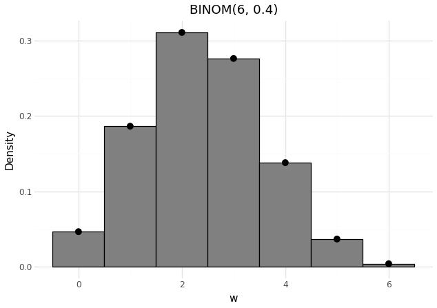

(sec:random_variates)=
# Generating Random Variates

In {ref}`sec:random_number_generation` we covered generating random
number from from the standard uniform distribution $U(0,1)$. In this
section we will see that once you are armed with an awesome, high
quality $U(0,1)$ RNG, you can generate variates from many other
distributions as well. We cover four main techniques:

- The Inverse Transform Method
- Composition
- Convolution
- Rejection sampling

:::{important} Why should you care about techniques for generating random variates?

Stochastic simulation methods, including discrete event simulation and
system dynamics, depend on the generation of variates to sample from
the distributions of the random variables that involved. Examples of
include the time to failure for mechanical component, and arrival
times of customers at a service locations. A good understanding of
probability distributions and the associated techniques for generating
variates is essential for modeling, implementation of simulations
models, analytics as well as validation and verification.
:::

(sec:inverse_transform_method)=
# The Inverse Transform Method

The setting is the following: we are given a univariate statistical
distribution with cumulative distribution function $F$. For now, we
assume that $F$ is strictly increasing across $0 < F(x) < 1$. Later,
we will see how this can be relaxed. Our goal is to generate variates
from this statistical distribution.

__Algorithm:__ (Inverse transform method - ITM)

  1. Generate $u$ from $U(0,1)$
  2. Return $x=F^{-1}(u)$

How do we know this is correct, and what do we have to demonstrate? We
need to show that the algorithm, viewed as a random variable $X =
F^{-1}(U)$ has CDF given by $F$.

\begin{align*}
 \Pr(X \le x) &= \Pr\bigl(F^{-1}(U) \le x \bigr)\\
	  &= \Pr\bigl(U \le F(x)\bigr) \\
	  &= F(x)\;.
\end{align*}

:::{important} Questions for thought:

1. What does it mean that $F$ is strictly increasing across the
   interval $0 < F(x) < 1$? Can you find an example of a CDF for which
   this is not the case? What does its PDF look like in this case?

2. Where was the assumption of "strictly increasing" used in the proof?

:::


:::{prf:example} Exponential distribution

The exponential distribution is the mandatory example that every
textbook on ITM will include. Recall that the exponential distribution
with rate $\lambda$ has PDF

\begin{equation*}
f(x) =
\begin{cases}
 \lambda e^{-\lambda x},& x \ge 0\\
 0, & \text{otherwise}\;,
\end{cases}
\end{equation*}

and CDF

\begin{equation*}
f(x) =
\begin{cases}
 1 - e^{-\lambda x},& x \ge 0\\
 0, & \text{otherwise}\;.
\end{cases}
\end{equation*}

In this case, solving $F(x) = u$ for $u$ gives $1-u = e^{-\lambda x}$
which after taking (natural) logarithms and sorting out terms leads to
$x = -\frac{1}{\lambda}\ln(1-u)$. The ITM applied to the exponential
distribution therefore becomes:

1. Sample $u$ from $U(0,1)$
2. Return $-\frac{1}{\lambda}\ln(1-u)$
:::


:::{exercise}

If you look in textbooks or online, you will find the following
alternative to the ITM for the exponential distributions:

1. Sample $u$ from $U(0,1)$
2. Return $-\frac{1}{\lambda}\ln(u)$

How can this also be correct? Hint: show that if $U \sim U(0,1)$ then
the random variable $1-U$ is also $U(0,1)$.

:::


### Visualizing the inverse transform method

What is the intuition behind the method? Consider the PDF $f$ in the
figure below.

:::{figure} figs/itm-visual-pdf.svg
:width: 600
:::

We expect that the ITM should produce more samples where $f$ is
large. And that is exactly what happens. For the ITM, we "shoot" from
the $y$-axis using the value $u$ we sampled from $U(0,1)$ as shown in
the the following figure:

:::{figure} figs/itm-visual-cdf-ai.svg
:width: 600
:::

The CDF is vertically more stretched out where $f$ is large, which is
precisely what increases the chance of generating samples where
$f$ is large.

:::{prf:example} Triangular distribution

The triangular distribution with parameters $(0, 1, 2)$ has PDF

\begin{equation*}
f(x) =
\begin{cases}
    x,       & \text{if } 0 \leq x < 1 \\
    2-x,     & \text{if } 1 \leq x \leq 2 \;,
\end{cases}
\end{equation*}

and CDF

\begin{equation*}
F(x) =
\begin{cases}
    x^2/2,     &  \text{if } 0 \leq x < 1 \\
    1 - (x-2)^2/2, &  \text{if } 1 \leq x \leq 2 \;.
\end{cases}
\end{equation*}

For the ITM, we see that the range $0 \le u < 1/2$ corresponds to $0
\le x < 1$ and the range $1/2 \le u <= 1$ corresponds to $1 \le x \le 2$.

To construct $F^{-1}$ we have to invert the two parts of $F$. For $u <
\frac{1}{2}$ we solve $\frac{x^2}{2} = u$ to obtain $X = \sqrt{2u}$;
for $u \ge \frac{1}{2}$ we get the equation $1-\frac{(x-2)^2}{2} = u$
which has solution $x = 2 \sqrt{2(1-u)}$. Here we had to choose the
sign so that the solution falls in $[1, 2]$.

The ITM algorithm for the triangular distribution is:
  1. Generate $u$ from $U(0,10)$
  1. If $0\le u < 1/2$ return $\sqrt{2u}$; if $1/2 \le u \le 1$ return $2 \sqrt{2(1-u)}$
:::


### What if the CDF $F$ is not strictly increasing?

For the ITM we required that $F$ be strictly increasing for $0 < F(x)
< 1$. What does $F$ look like if this is not the case? What does its
PDF $f$ look like? It happens if the interval defined by $0 < F(x) <
1$ contains intervals $I = [x_1,x_2]$ such that $f(x) = 0$ whenever
$x\in I$. We have illustrated one such case below:

:::{figure} figs/cdf-not-strictly-increasing.svg
:width: 600
An example where the CDF $F$ is not strictly increasing across the interval $1 < F(x) < 1$.
:::

In this case if $u=1/2$ we obtain $F^{-1}(u) = [1,2]$. How do we solve
this? Rather than using $F^{-1}$ as before, we take the generalized
inverse defined as

\begin{equation*}
F^{-1}(u) = \inf \{x \in \mathbb{R} \mid F(x) \ge u\}\;.
\end{equation*}

In this example $\{x\in\mathbb{R} \mid F(x) \ge 1/2\} = [1,\infty)$
and thus $F^{-1}(u) = \inf [1,\infty) = 1$. Here $\inf$ denotes the
infimum, see [https://en.wikipedia.org/wiki/Infimum_and_supremum].


### The discrete distribution

Here we show how the ITM can be used with the discrete distribution
$X$ with sample space

\begin{equation*}
  \Omega = \{x_1, x_2, \ldots, x_n\}\;,
\end{equation*}

where $x_1 < x_2 < \cdots < x_n$, and the probability mass function
(PMF) is given by $p_i = \Pr(X = x_i)$ for $1 \le i \le n$. To be a valid
PMF, we require that $p_1 + p_2 + \cdots + p_n = 1$.

The CDF of the PMF is given by

\begin{equation*}
F(x) = \Pr(X \le x) = \sum_{i \atop \text{s.t. } x_i \le u } p_i
\end{equation*}

Looking at the generalized inverse from earlier

\begin{equation*}
F^{-1}(u) = \inf \{x \in \mathbb{R} \mid F(x) \ge u\}\;,
\end{equation*}

we see that $u$ is mapped to the $x_i$ where $i$ is the smallest index
such that $p_1 + p_2 + \cdots + p_i$ equals or exceeds $u$.


There is a very intuitive way to see how this work. Consider the
following diagram where we have stacked the $p_i$ intervals
left-to-right.

:::{figure} figs/discrete-distribution.svg
:width: 600
:::

The ITM in this case generates $u$ from $U(0,1)$. We then determine
which interval the $u$ falls into and pick the corresponding value of
$x$. If $u$ falls precisely on the boundary between $x_i$ and
$x_{i+1}$ we pick the larger value $x_{i+1}$ to match $F^{-1}(u)$, see
the previous subsection.


__Python__: in Python you can use [scipy.stats.rv_discrete](https://docs.scipy.org/doc/scipy/reference/generated/scipy.stats.rv_discrete.html) for this.


::::{prf:example} Sampling from a custom distribution

We have the following probability density function $f$:

\begin{equation*}
f(x) =
\begin{cases}
x^2,& 0 \le x < 1\;,\\
\frac{2}{3},& 1\le x \le 2\;,\\
0,& \text{otherwise.}
\end{cases}
\end{equation*}

How can a such a distribution arise? As we will see in the chapter on
distribution modeling, it may be the result of mapping a sample
(observations of a random variable) into a PDF that does not match any of
the standard distributions. It may have been derived through a
combination of domain expertise, system insights, and distribution
modeling handy-work. Regardless, we have a the probability density
function $f$ and we would like to generate variates from its
distribution.

Before we start, it is always fair to ask if this a valid PDF. Is this the case?

\begin{equation*}
\int_\Omega f(x)\, dx
= \int_0^1 x^2\,dx + \int_{1}^2 \frac{2}{3} dx
= [\frac{x^3}{3}]_0^1 + [\frac{2x}{3}]_1^2
= 1/3 + 2/3 = 1
\end{equation*}

(Here $\Omega = [0,2]$ is the sample space.)

To use the ITM we first need to determine the CDF $F$. For a split
function like $f$, we break this up as follows:

- For $x < 0$ we have $F(x) = 0$.
- For $0 \le x < 1$ we have
\begin{equation*}
F(x) = \int_0^x f(\xi)\, d\xi = \int_0^x \xi^2\, d\xi = [\frac{\xi^3}{3}]_0^x = \frac{1}{3}x^3\;.
\end{equation*}
- For $1 \le x <= 2$ we have
\begin{equation*}
F(x)
= \int_0^x f(\xi)\, d\xi
= \frac{1}{3} + \int_1^x \frac{2}{3}\, d\xi
= \frac{1}{3} + [\frac{2\xi}{3}]_1^x
= \frac{2}{3}x - \frac{1}{3}\;.
\end{equation*}
- If $x\ge 2$ then $F(x) = 1$.

For $0 \le u < \frac{1}{3}$ we have $F^{-1}(u) = \sqrt[3]{3u}$. Why
this $u$-range? Because $F$ at the rightmost point of $[0,1]$ equals
$\frac{1}{3}$. Similarly, for $\frac{1}{3} \le u \le 1$ we invert $F$
to obtain $F^{-1}(u) = \frac{3}{2} u + \frac{1}{2}$.

The ITM-based method for generating variates for the distribution with PDF given by $f$ is:


:::{prf:algorithm}
- Generate $u$ from $U(0,1)$
- If $u \in [0, \frac{1}{3})$ return $\sqrt[3]{3u}$
- Else If $u\in[\frac{1}{3},1]$ return $\frac{3}{2} u + \frac{1}{2}$
:::
::::


### Challenges for the inverse transform method

The ITM relies on being able to invert the CDF $F$. In many cases,
analytically deriving $F^{-1}$ may be challenging, and one may have to
resort to numerical methods. If the numerical method is complex, one
may incur a time penalty, and one should perhaps consider
alternatives. As we will see, generating variates from the triangular
distribution can also be done using the convolution method which we
cover later.


<!-- ---------------------------------------------------------------------- -->

(sec:composition_method)=
# The Composition Method

The composition method is a technique that can be used to generate
random variates from a target distribution with CDF $F$ that can be
expressed as a weighted sum (or "composition") of other CDFs $F_1,
F_2,\ldots, F_n$. Specifically,

\begin{equation*}
F(x) = \sum_{i=1}^n p_i F_i(x) \;,
\end{equation*}

where $p_1 + p_2 + \cdots + p_n = 1$.


:::{prf:algorithm} Composition
  1. Generate a variate $k$ from the discrete distribution over
     $\{1,2,\ldots, n\}$ where $\Pr(k) = p_k$, see the discrete
     distribution in the section on the inverse transform method.

  2. Generate a variate $x$ from the distribution with  CDF $F_k$.
:::

Why does this work? The algorithm defines a random variable, $X$
say. To demonstrate that it is valid, we must show that the $X$ has
the correct CDF. For a two-step sequential algorithm like this, it is
natural to reach for a tool like the Law of Total Probability, where
we also introduce conditional probabilities through the relation
$\Pr(A \cap B) = \Pr(A | B)\Pr(B)$. This is a very standard approach
well worth knowing. Armed with this, we want to condition on the
outcome of Step 1, which we capture as a random variable $\text{Idx}$.

\begin{equation*}
\Pr(X \le x) = \sum_{k=i}^n \Pr(X \le x \mid \text{Idx} = k) \Pr(\text{Idx} = k)
\end{equation*}

The first factor in the sum equals $F_k(x)$; the second factor is
simply $p_k$.  We can therefore conclude that

\begin{equation*}
\Pr(X \le x) &= \sum_{k=i}^n p_k F_k(x) = F(x)
\end{equation*}

which is what we wanted.

<!--
The following proof demonstrates that the variate $X$ generated by the algorithm above
does converge into $F(x)$ when (2) is met when using the law of total probability and the
definition of a CDF.

:::{prf:proof} Composition Proof
:class: dropdown
For any fixed $x$,

```{math}
:label: Composition

P(X \le x) = \sum_{i} P(X \le x | I = i) \cdot P(I = i) \\

= P(X < x | I = i) \cdot  p_i\\

= \sum_{i} F_i(x) \cdot p_i \\

= F(x) \\
```
:::
-->


__Question:__ Why do we require that $p_1 + p_2 + \cdots + p_n = 1$?
Would anything else work?

<!--
Law of Total Probability, $F(x) = \sum_{i} F_i(x) p_i$. What property
of the $p_i$ weights is necessary for $F(x)$ to be a valid Cumulative
Distribution Function (CDF)? -->

:::{prf:example} Laplace Distribution

The general Laplace distribution is a continuous distribution over
$\Omega = \mathbb{R}$ defined by

\begin{equation*}
f(x) = \frac{1}{2b} e^{-\frac{|x-\mu|}{b}} \;,
\end{equation*}

where $\mu$ is its __location parameter__ and $b$ is its __scale
parameter__. One can show that $\mathbb{E}[X] = \mu$ and
$\mathbb{V}[X] = 2b^2$. The PDF is clearly symmetric about its mean
$x=\mu$.

To demonstrate the composition method for the Laplace distribution we
limit ourselves to the case where $\mu=0$ and $b = 1$. The PDF is the
sum of an exponential distribution with rate parameter $\lambda = 1$
and its "reflection" about the second axis, both weighted by a factor
$\frac{1}{2}$. Formally, its PDF and CDF are

\begin{equation*}
f(x) =
\begin{cases}
\frac{1}{2}e^x, & x < 0 \\
\frac{1}{2}e^{-x}, & x \ge 0
\end{cases}
\quad \text{and} \quad
F(x) =
\begin{cases}
\frac{1}{2}e^x, & x < 0 \\
1-\frac{1}{2}e^{-x}, & x \ge 0 \;.
\end{cases}
\end{equation*}

How do we write this as a weighted sum of CDFs? With some experience
and some use of the "staring method" you will see that

\begin{equation*}
F_1(x) =
\begin{cases}
e^x, & \text{if } x < 0\;, \\
1, & \text{if } x \ge 0\;,
\end{cases}
\quad \text{and} \quad
F_2(x) =
\begin{cases}
0, & \text{if } x < 0\;, \\
1-e^{-x}, & \text{if } x \ge 0\;,
\end{cases}
\end{equation*}

where $F_1$ is the CDF of the negative exponential distribution. You
can now verify that

\begin{equation*}
F(x) = \frac{1}{2} F_1(x) + \frac{1}{2} F_2(x) \;
\end{equation*}

How do we sample from the distributions with CDFs $F_1$ and $F_2$? We
can use the inverse transform method for this, seeing that they are
both easy to invert: for $F_1$ we get $F^{-1}(u) = \ln u$ and for
$F_2$ we get $F_2^{-1}(u) = -\ln(1-u)$.

The composition method applied to the Laplace distribution
gives us the following algorithm for generating variates:

__Algorithm:__

- Generate $u$ from $U(0,1)$.
- If $u < 1/2$ generate a variate from the distribution given by the CDF $F_1$:
   - Generate $u_1$ from $U(0,1)$
   - Return $F_2^{-1}(u_1) = \ln u_1$
- If $u \ge 1/2$ generate a variate from the distribution given by the CDF $F_2$:
   - Generate $u_2$ from $U(0,1)$
   - Return $F_2^{-1}(u_2) = -\ln (1- u_2)$

It is important to realize that you first generate $u \in U(0,1)$ to
determine which of the distributions/CDFs to use. In this case, we
could also have used the discrete distribution with values $\{1,2\}$
and $p_1 = p_2 = \frac{1}{2}$, but here that simplifies to
precisely what we used. Following the random selection of
distribution, you will also have to generate additional variates when
you sample from the respective distributions. The composite method,
unlike the inverse transform method, therefore requires one to
generate at least two variates.

<!--

We then apply the inverse transform method:
If $U_1 < 0.5$, We sample from $F_1$.

We solve $F_1(X) = U_2$:$$e^X = U_2 \implies X = \ln(U_2)$$

If $U_1 \ge 0.5$ (50\% chance): We sample from $F_2$. We solve $F_2(X) = U_2$:

$$1 - e^{-X} = U_2 \implies e^{-X} = 1 - U_2 \implies X = -\ln(1 - U_2)$$

Notice that if $U_2$ is a $\text{Uniform}(0, 1)$ variable, the term $1 - U_2$ is also distributed as a $\text{Uniform}(0, 1)$ variable. This means we can replace the $\ln(1 - U_2)$ term with $\ln(U_2)$ without changing the result.

This simplifies our algorithm to: If $U_1 < 0.5$: $X = \ln(U_2)$; otherwise, $U_1 \ge 0.5$: $X = -\ln(U_2)$.

$$X \leftarrow \begin{cases} \ln(U) & p = 1/2 \\ -\ln(U) & p = 1/2 \end{cases}$$
-->

:::


<!-- ---------------------------------------------------------------------- -->

(sec:convolution_method)=
# The Convolution Method

Sometimes we can express a random variable $X$ as a sum of independent
random variables $X_1, X_2, \ldots, X_n$:

\begin{equation}
\label{eq:convolution}
 X = X_1 + X_2 + \cdots + X_n \;
\end{equation}

Note that the distribution for the sum of random variables is called a
convolution of their distributions, hence the name for this
method. Once we have decomposed our random variable as in
{ref}`eq:convolution` we can use the following algorithm to generate
variates from the distribution of $X$:


__Algorithm:__

  1. Generate a variate $x_k$ from the distribution for $X_k$ for $1\le
     k \le n$ independently.

  2. Return $X = X_1 + X_2 + \cdots + X_n$

The idea behind using this method is that we know how to generate
variates from the distributions for the $X_i$'s, preferably in an
efficient way. When do we use convolution? Insight comes with
practice.  The close to mandatory example of this method is to show
how one can sample from the binomial distribution using its
decomposition into a sum of independent Bernoulli random variables.

:::::{prf:example} The binomial distribution

Let $X_k$ with $1\le k \le n$ be IID Bernoulli random variables with
parameter $p$. We are interested in their sum, and it is natural to
consider $X = \sum_{i=1}^n X_i$. From probability, we know $X$ is
binomial with parameters $n$ and $p$.

In case you do not remember this, here is a quick reminder. To derive
the PMF of $X$ we reason as follows: for $\Pr(X = m)$, precisely $m$
of the random variable $X_k$. By basic combinatorics, there are
$\binom{n}{m}$ such configurations of values, each of which has
probability $p^m (1-p)^{n-m}$. It then follows $P(X=m) = \binom{n}{m}
p^m (1-p)^{n-m}$ for $0 \le m \le n$, which is precisely the PMF of
the binomial distribution with parameters $n$ and $p$.


As an illustration, we can apply the algorithm listed upstairs to
generate a sample of size $N$ and show its normalized histogram
(effectively the Monte Carlo method). The example uses $n=6$ and $p=0.4$.



::::{admonition} Simulation Code
:class: dropdown

```{code} python
import numpy as np
import pandas as pd
from scipy.stats import binom
from plotnine import (ggplot, aes, geom_histogram, geom_point, theme_minimal, labs)

np.random.seed(2025)
n_samples = 1_000_000
x = np.random.binomial(5, 0.4, n_samples)
y = np.random.binomial(1, 0.4, n_samples)
w = x + y

print(f"Mean of x: {x.mean():.4f}") # 2.003
print(f"Mean of y: {y.mean():.4f}") # 0.3997
print(f"Mean of w: {w.mean():.4f}") # x + y = 2.4

df_w = pd.DataFrame({'w': w})
k = np.arange(7)
pdf = binom.pmf(k, 6, 0.4)
df_pdf = pd.DataFrame({'k': k, 'pdf': pdf})
hist_breaks = np.arange(-0.5, 7.5, 1)

p = (ggplot(df_w, aes(x='w'))
    + geom_histogram(
        aes(y='..density..'),
        breaks=hist_breaks,
        fill="gray",
        color="black"
    )
    + geom_point(
        data=df_pdf,
        mapping=aes(x='k', y='pdf'),
        color="black",
        size=3
    )
    + labs(
        title="BINOM(6, 0.4)",
        y="Density",
        x="w"
    )
    + theme_minimal()
)
p.show()
```

::::

:::::


:::{prf:example} Poisson process

From queuing theory under a Poisson process with parameter $\lambda$,
you know that the inter-arrival times are independent and exponentially
distributed with parameter $\lambda$. You may recall that the
inter-arrival time $W_n$ for the $n$-th inter-arrivals are Erlang with
parameter $n$ and $\lambda$, $W_n$ being a sum of IID exponentially
distributed random variables:

\begin{equation*}
W_n = X_1 + X_2 + \cdots + X_n
\end{equation*}

To sample from the Erlang distribution $W_n(\lambda)$ we may therefore
use the convolution method. Whether one should do this is another
matter: it may be all right when $n$ is small (e.g., $\le 5$), but for
large $n$ one may have to consider the computational cost and other
methods.

:::


::::{prf:example} Triangular distribution

We already saw the symmetric triangular distribution $(0,1,2)$ in the
section on the inverse transform method. Here we consider its cousin
given by $(-1,0,1)$, and will show how we can use the method of
convolution. Here is the algorithm:

__Algorithm:__
  1. Sample $u_1, u_2$ independently from $U(0,1)$
  2. Return $u_1 + u_2 - 1$.

Does that really work? Let's do some convolutions! Consider the random
variable $X = Y_1 + Y_2$ where $Y_1, Y_2$ are IID $U(0,1)$ with sample
space $\Omega_X = [0,2]$.  The joint PDF of $Y_1$ and $Y_2$ is given
by $f_{Y_1,Y_2}(y_1, y_2) = 1$ if $(y_1, y_2) \in [0,1]^2$ and equals
zero otherwise. We want to determine the CDF for $X$ which is given by

\begin{equation*}
F_X(x) = \Pr(X = Y_1 + Y_2 \le x)
= \int_R f(y_1,y_2)\, dy_2 dy_1 \;,
\end{equation*}

where $R$ is the region "under the the line $y_1 + y_2 = x$. Some care
is required to distinguish the cases $x \le 1$ and $x>1$.

:::{figure} figs/triangle-distribution-convolution.svg
:width: 400
:::

For the case $x \le 1$ we see that the integral is just the area of a
right triangle with side $x$, that is $\frac{1}{2} x^2$, and $F(x) =
\frac{1}{2} x^2$.

For $x>1$, the area we are looking for is that of the unit square, but
with the upper right corner chopped off. How large is the area of this
upper right corner? Answer: $1 - \frac{1}{2} (2-x)^2 = 2x -1 -
\frac{1}{2} x^2$, and thus $F(x) = 2x -1 - \frac{1}{2} x^2$. This gives us the PDF $f$ of $X$:

\begin{equation*}
f(x) =
\begin{cases}
x,& 0 \le 0 \le x < 1\;,\\
-x + 2, & x \le 2\;
\end{cases}
\end{equation*}

This matches exactly what we had under the inverse transform method,
which is worrisome: this is the $(0,1,2)$ triangular distribution. We
want $(-1,0,1)$. Subtracting $1$ takes care of that, neatly shifting
the PDF to the left centering it at $x=0$, justifying the algorithm
given at the beginning of the example.

For reference, we note that this is a special case of the
[Irwin-Hall  distribution](https://en.wikipedia.org/wiki/Irwin%E2%80%93Hall_distribution). This
distribution is given by $X = \sum_{k=1}^n Y_k$ where the $Y_k$'s for
$1\le k \le n$ are IID $U(0,1).$ We looked at the special case
$n=2$.

::::


(sec:rejection_sampling)=
# Rejection Sampling

Acceptance-rejection sampling is usually used when there is not a tractable, closed-form
expression for the target distribution's CDF $F(x)$. The goal is to generate variates $X$ from the density function $f
(x)$ of the target distribution. A requirement is that we must select a function $t(x)$ that _majorizes_ $f(x)$ for all
of $x$. However, t(x) is not a density, therefore, we need to set $c$ which is defined as $\int^{\infty}_{-\infty} t(x) dx \ge 1$,
and then define $d$ as a density that applies for all of $x$ as $d(x) = \frac{t(x)}{c}$.

__Algorithm:__

  1. Generate $Y$ having density d
  2. Generate $U$ from $U(0,1)$, independent of $Y$
  3. If $U \le \frac{f(Y)}{t(Y)}$, return $X = Y$ and stop (accept), else return to step 1 (reject)

The proof below shows how the algorithm given enough samples will converge into $f(x)$ using the
definition of conditional probabilities, law of total probability, calculus, and basic algebra.

:::{prf:proof} Long Proof: Rejection Sampling
:class: dropdown
This proof is based on the Rejection Sampling method from {cite:t}`liu2001monte`.

We get a $X$ conditional on acceptance from step 3, therefore, by the definition of conditional probabilities:

$$P(X \le x) = \frac{P(\text{acceptance}, Y \le x)}{P(\text{acceptance})}$$

And for any $y$:
$$P(\text{acceptance}| Y = y) = P(U \le \frac{f(y)}{t(y)}) = \frac{f(y)}{t(y)}$$

Because in step 2, we defined $U \sim U(0,1)$, and $Y$ is independent of $U$, and t(y) majorizes f(y), therefore:

```{math}
P(\text{acceptance, } Y \le x)= \int^{\infty}_{-\infty} P(\text{acceptance, } Y \le x| Y = y) \cdot r(y) dy
```

When then split this into the sum of two integration regions, the acceptance range and the rejection range
(aka what is below X and what is above X, respectively).

```{math}
\int^{X}_{-\infty} P(\text{acceptance, } Y \le x | Y = y) \cdot r(y) dy + \int^{\infty}_{X}P(\text{acceptance}, Y \le x | Y = y) \cdot r(y) dy
```

Which then simplifies into

$$\int^{X}_{-\infty} P(\text{acceptance}, Y \le x | Y = y) \cdot r(y) dy$$

And once we substitute in our definition of r(y)

$$\frac{1}{c} \int^{x}_{-\infty} t(y) dy$$

Which simplifies to

$$\frac{F(x)}{C}$$

However, we need to show how to reobtain $F(x)$, our original function from this simplification.
In this case, we can obtain $\frac{1}{c}$ from our probability of acceptance after substituting our
$r(y)$ and performing simplification.

$$P(\text{acceptance}) = \int^{\infty}_{-\infty} P(\text{acceptance}| Y = y) \cdot r(y) dy $$

Which becomes

$$\frac{1}{c} \int^{\infty}_{-\infty} \frac{f(y)}{t(y)} t(y) dy$$

Then we apply the multiplication of reciprocals (which always become 1), and simplify $\int^{\infty}_{-\infty} F(x)$
as one because it is a density, and therefore also equal to one, to get $\frac{1}{c}$.

Finally, we substitute our $P(\text{acceptance, } Y \le x)$ and $P(\text{acceptance})$ into the our definition of the
conditional probability, $\frac{P(\text{acceptance, } Y \le x)}{P(\text{acceptance})}$, giving us $F(x)$ through
algebraic manipulation.

$$\frac{F(x)/c}{1/c} \rightarrow F(x)$$
:::

__Question__: The method requires an "envelope" $c \cdot g(x)$ such that $f(x) \le c \cdot g(x)$. What property of the constant $c$ is essential for the acceptance probability $P(\text{acceptance})$ to be valid, and where in the proof is this used?

Now, how can we use rejection sampling?

:::{prf:example} Half-Normal Random Variable

This example is based off {cite}`ross2022simulation`. In this example, we
wish to generate a standard half-normal RV with PDF using rejection sampling:

$$f(x) = \frac{2}{\sqrt{2\pi}}e^{-x^2/2}, \quad x \geq 0.$$

Then we use the majorizing function:
$$t(x) = \sqrt{\frac{2e}{\pi}} e^{-x} \text{ } \forall x \text{ } \ge 0$$

When we calculate $c$, we take the integral of $t(x)$ upon x:
$$c = \sqrt{\frac{2e}{\pi}} \int_{0}^{\infty} e^{-x} dx \rightarrow  \sqrt{\frac{2e}{\pi}}  = 1.3155$$

Then we get the proposed density function $h(y)$ through dividing $t(y)$ over $c$:

$$h(y) \equiv \frac{t(y)}{c} = e^{-y}$$

And then we need $g(y)$, the ratio of $f(y)$ and $t(y)$, which represents the rejection ratio.
$$g(y) = \frac{f(y)}{t(y)} = e^{-\frac{(y-1)^2}{2}}$$

Once we have our functions, we can then apply the algorithm which allows us to have a random variate representing the half-normal r.v:

1) Generate $Y$ from the "proposed density" $h(y) = e^{-y}$.
2) Generate $U \sim \text{Uniform}(0, 1)$.
3) Accept/Reject: Check if $U \le g(Y)$, where $g(Y)$ is the ratio from Equation (32):

$$U \le e^{-\frac{(Y-1)^2}{2}}$$
if it passes, accept, return $X$ = $Y$; otherwise reject. Go back to step 1.
:::

# Problems Left to the Reader

:::{seealso} Problem 1 (Software Implementation of Random Variate)
Supposed that a Random Variable, $B$ has the following p.d.f:

$$f(x) = \begin{cases}
    0 & \text{if } x < 0 \text{ or } x > 2 \\
    x & \text{if } 0 \le x \le 1 \\
    \frac{1}{2} & \text{if } 1 \le x \le 2
\end{cases}$$

a) Use a method for generating realizations $B$ through any of the four methods, some are likely to
be easier than others.

b) Write code that implements the inverse transform method for this p.d.f.

c) How would you computationally verify that your simulation method is correct?

d) Compare the Inverse Transform method and the Rejection Sampling method for this specific p.d.f.
:::

:::{seealso} Problem 2 (Analytic Application: Machine Failure)
A machine is taken out of production either if it fails or after a period of 7 hours. By running
similar machines until failure, it has been found that time to failure, $F$, has the Weibull distribution with
$\alpha = 9, \beta = 0.55, \text{ and } \nu = 0$.

a) Write out a step-by-step procedure for generating the time, $X$, until the machine is out of production. _Hint_: This can be expressed through $X = min(F, 7)$.

b) Calculate the probability is the machine is taken out of production exactly at 7 hours, $P(X=7)$, then the expected time that machine is in production, $E[X]$.

c) Using Crude Monte Carlo, Empirically Estimate $E[X]$ and $P(X=7)$ using $n = 1,000$ samples.

d) Compare your Empirical Estimate to your Analytical Answer from (b).

:::

:::{warning} Problem 3 (Analytic Exam-Style Question)
Domain experts have provided their insights regarding a random
variable that is part of a stochastic model. The insight comes in the
form of the following probability density function

\begin{equation*}
  f(x) =
  \begin{cases}
    c e^{2x},& x \le 0,\\
    c e^{-2x},& x > 0\;
  \end{cases}
\end{equation*}

that captures the associated random variable $X$ of your model.

a) Determine the constant $c$. _Hint_: Use symmetry to
save yourself some work.

b) Construct an algorithm for sampling from $X$ using the
inverse transform method.

c) Explain how you could use the convolution method to
construct an algorithm for sampling.

d) A second random variable $Y$ for the model is given by the
probability density function

\begin{equation*}
 g(x) \propto f(x) \sin^2(x), \qquad x\in\mathbb{R} \;.
\end{equation*}

Here $g(x) \propto f(x) \sin^2(x)$ means that $g(x)$ is given by
$f(x)\sin^2(x)$ up to a multiplicative constant. For rejection
sampling, explain why you do not need to determine this constant.

e) Prepare an algorithm for generating variates from the
distribution of $Y$ in (c) using rejection sampling, basing it
on the sampling method you developed in (b).
:::

:::{warning} Problem 4 (Computational Exam-Style Question: Rejection Sampling)
You need to generate samples from a target distribution $g(x)$ on the interval $x \in [-\pi, \pi]$.

The distribution is proportional to a "cosine bump":
$$g(x) \propto 1 + \cos(x), \quad x \in [-\pi, \pi]$$

You decide to use a uniform majorizing distribution, $f(x)$, which is the PDF for $U(-\pi, \pi)$:

$$f(x) = \frac{1}{2\pi}, \quad x \in [-\pi, \pi]$$

a) Analytically find the smallest constant $M$ such that $g(x) \le M \cdot f(x)$ for all $x$. _Hint_: The non-normalized target is $h(x) = 1 + \cos(x)$. You need to find $M = \sup_x \frac{h(x)}{f(x)}$.

b) Write Code that generates a single accepted sample $Y$ using rejection
sampling.

c) Use your function from part (b) to generate 10,000 accepted samples. Plot a histogram of your samples. On the same plot, overlay the true, normalized PDF $g(x)$.

d) Analyze Efficiency:Keep track of the total number of proposals $N_{total}$ and the number of accepted samples $N_{accepted}$. Calculate the empirical acceptance rate $\frac{N_{accepted}}{N_{total}}$. Compare this to the theoretical acceptance rate, which is $\frac{1}{M}$.
:::
