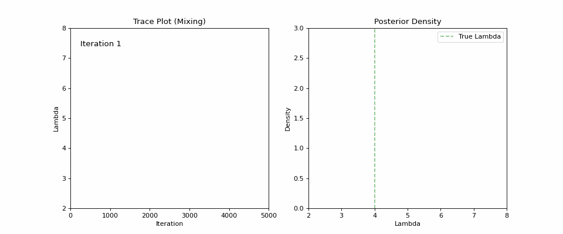
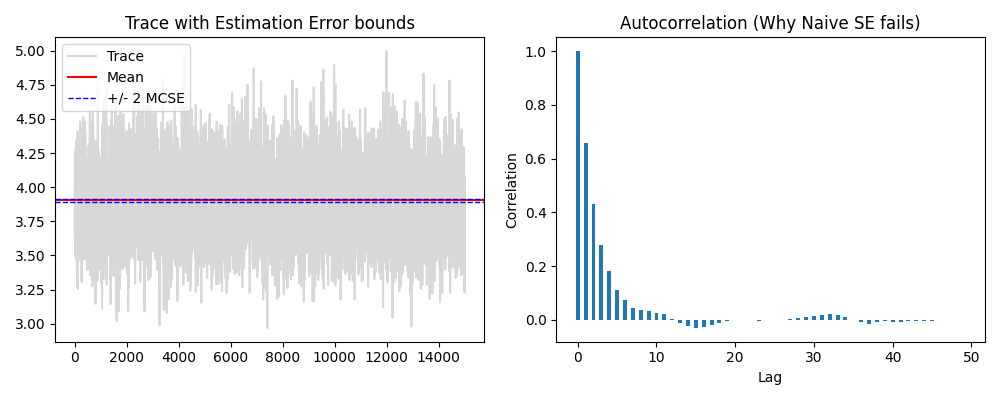
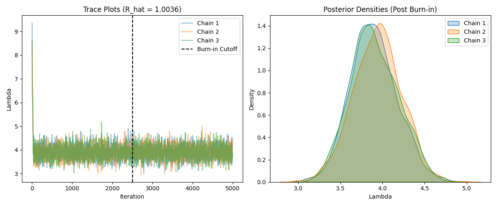

(sec:MCMC)=
# Markov Chain Monte Carlo (MCMC)

MCMC is often used to estimate parameters
such as variance or an expected value,
sample from a continuous random variable,
complex posterior distributions. These
uses often come up in simulation when
trying to generate random variates for
discrete events or to improve the fit
of distributions to existing data.

## What is MCMC?

In general, Markov Chain Monte Carlo methods
refer to a family of algorithms that estimate
a posterior distribution through a Markov Chain.
This chain represents a random sequence of
samples following the Markovian property.
Through this method, it becomes possible to
draw from the unknown posterior distribution
using a density representing the transition
rates in the irreducible, aperiodic and
recurrent Markov Chain. Note that these properties ensure that the MCMC algorithm asymptotically converges to the posterior distribution. And they can be formally expressed through the following equation.

```{raw} latex
\begin{figure}[htbp]
    \[
        \pi(\boldsymbol{\theta}^{(s)} \mid \boldsymbol{y}) = \int_{\Theta} q(\boldsymbol{\theta}^{(s)} \mid \boldsymbol{\theta}^{(s-1)}) \pi(\boldsymbol{\theta}^{(s-1)} \mid \boldsymbol{y}) \, d\boldsymbol{\theta}^{(s-1)}.
    \]
    \caption{\textbf{Global Balance Equation for the Posterior.} This expression illustrates the condition for stationarity in a Markov Chain. $\pi(\boldsymbol{\theta} \mid \boldsymbol{y})$ represents the target posterior density, and $q(\boldsymbol{\theta}^{(s)} \mid \boldsymbol{\theta}^{(s-1)})$ represents the transition kernel probability of moving from state $s-1$ to $s$. The equation shows that marginalizing the joint density of the transition and the previous state over the entire parameter space $\Theta$ yields the target distribution again, proving that $\pi$ is the stationary distribution of the chain.}
    \label{fig:posterior_stationarity}
\end{figure}
```

The proofs supporting this process are found
in pg. 205 - 247 of the book {cite}`robert1999monte`,
as that is outside the scope of this chapter.

Now, that we have discussed the fundamental requirements
and purposes of MCMC, there are two major implementations
of MCMC used in practice:

- Metropolis-Hastings (Gibbs Sampling is a Special Case of MH with 100% Sample Acceptance Rate)
- Hamiltonian Monte Carlo

### Metropolis-Hastings Algorithm (MHA)

Metropolis-Hastings is a commonly-used MCMC method for sampling from a posterior distribution, $\pi(\boldsymbol{\theta} \mid \mathbf{y})$, where the normalizing constant is unknown. We only require a function $f(\boldsymbol{\theta}) \propto \pi(\boldsymbol{\theta} \mid \mathbf{y})$ that we can evaluate.

The algorithm generates a sequence of states $\boldsymbol{\theta}^{(s)}$ that asymptotically converge to $\pi$.

In this case, MHA starts with a MCMC-compliant
Markov chain to generate a sequence of $\theta^{s}$
that asymptotically converge to the posterior
distribution. Now, we select an arbitrary state
on the Markov chain, $\theta^{(0)}$, and we want to move
to $\theta^{(1)}$.

The first step for this process is to generate a candidate
state $\theta^c$ originates from a proposal distribution, $q$, that we know how to sample from this is similar to rejection sampling from {ref}`sec:random_variates`, for example, a
Gaussian, $\alpha|\theta^{(s-1)} \sim \mathcal{N}(x_{n}, \sigma^2)$.

After doing this step, we then move on to the accept-reject
step. Where the acceptance probability, which is defined through this expression:

```{raw} latex
\begin{figure}[htbp]
    \[
        \alpha(\boldsymbol{\theta}^{(s-1)}, \boldsymbol{\theta}^{c}) = \min \left\{ \frac{q(\boldsymbol{\theta}^{(s-1)} \mid \boldsymbol{\theta}^{c})\pi(\boldsymbol{\theta}^{c} \mid \boldsymbol{y})}{q(\boldsymbol{\theta}^{c} \mid \boldsymbol{\theta}^{(s-1)})\pi(\boldsymbol{\theta}^{(s-1)} \mid \boldsymbol{y})}, 1 \right\},
    \]
    \caption{\textbf{Acceptance-Rejection Ratio.} This equation defines the acceptance probability $\alpha(\boldsymbol{\theta}^{(s-1)}, \boldsymbol{\theta}^{c})$ for a proposed move in the Metropolis-Hastings algorithm. The ratio compares the posterior density $\pi$ and proposal density $q$ of the candidate state $\boldsymbol{\theta}^c$ against the current state $\boldsymbol{\theta}^{(s-1)}$. By accepting moves according to this probability, the algorithm corrects for asymmetry in the proposal distribution and ensures the Markov chain converges to the correct target posterior.}
    \label{fig:mh_acceptance_ratio}
\end{figure}
```

The overall algorithm can be expressed using this
sequence based on {cite}`robert1999monte`:

```{raw} latex
\begin{algorithmic}[1]
    \State \textbf{Initialization:} Choose an initial value $\boldsymbol{\theta}^{(0)}$ satisfying $\pi(\boldsymbol{\theta}^{(0)} \mid \boldsymbol{y}) > 0$.
    \State Set iteration counter $s = 1$.
    \While{$s \leq N$}
        \State \textbf{Proposal:} Generate a candidate state $\boldsymbol{\theta}^c$ from the proposal distribution:
        \[
            \boldsymbol{\theta}^c \sim q(\cdot \mid \boldsymbol{\theta}^{(s-1)})
        \]
        \State \textbf{Acceptance Probability:} Calculate the acceptance ratio $\alpha$:
        \[
            \alpha = \min \left\{ \frac{\pi(\boldsymbol{\theta}^c \mid \boldsymbol{y}) q(\boldsymbol{\theta}^{(s-1)} \mid \boldsymbol{\theta}^c)}{\pi(\boldsymbol{\theta}^{(s-1)} \mid \boldsymbol{y}) q(\boldsymbol{\theta}^c \mid \boldsymbol{\theta}^{(s-1)})}, 1 \right\}
        \]
        \State \textbf{Accept/Reject:} Generate a uniform random number $u \sim \mathcal{U}(0,1)$.
        \If{$u \le \alpha$}
            \State $\boldsymbol{\theta}^{(s)} \gets \boldsymbol{\theta}^c$ \Comment{Accept the candidate}
        \Else
            \State $\boldsymbol{\theta}^{(s)} \gets \boldsymbol{\theta}^{(s-1)}$ \Comment{Reject; stay at current state}
        \EndIf
        \State Increment $s \gets s + 1$.
    \EndWhile
\end{algorithmic}
```

:::{figure}figs/metropolis_optimized.mp4
Here is an visualization of the algorithm and convergence
into the posterior distribution.
:::

Here is a trivial example of a problem that can be solved
using MHA.

:::{prf:example} MHA: Inferring Poisson Rate $\lambda$

Let's assume we observe data $y$ and want to infer the rate parameter $\lambda$ of a Poisson distribution. The posterior is proportional to likelihood $\times$ prior: $\pi(\lambda) \propto \frac{\lambda^y e^{-\lambda}}{y!} \cdot \pi_{prior}(\lambda)$.

We can apply the MHA to sample $\lambda$ as follows:

1. **Initialize:** Start with a random parameter value $\lambda^{(0)} > 0$.
2. **Propose:** Given the current state $\lambda^{(s-1)}$, generate a candidate $\lambda^*$ using a Gaussian Random Walk (symmetric proposal):
    $$\lambda^* \sim \mathcal{N}(\lambda^{(s-1)}, \sigma^2)$$
3. **Acceptance Ratio:** Calculate $\alpha$:
    $$\alpha = \min\left(1, \frac{\pi(\lambda^* \mid y)}{\pi(\lambda^{(s-1)} \mid y)}\right)$$
    *Note: Since the Gaussian proposal is symmetric ($q(\lambda^*|\lambda^{(s-1)}) = q(\lambda^{(s-1)}|\lambda^*)$), the $q$ terms cancel out.*
4. **Decision:** Generate $u \sim \mathcal{U}(0,1)$.
    * If $u \le \alpha$, set $\lambda^{(s)} = \lambda^*$.
    * Otherwise, set $\lambda^{(s)} = \lambda^{(s-1)}$.

In Python, this is possible to implement using this snippet
of code (or by using a more advanced method using a package
like PyMC).

```{code} python
import numpy as np
import matplotlib.pyplot as plt
import matplotlib.animation as animation
from scipy.stats import poisson, gamma, norm, gaussian_kde

np.random.seed(42)
lambda_true = 4.0
n = 50
x_data = np.random.poisson(lambda_true, n)


def log_likelihood(x, lam):
    """Log-likelihood: Sum of log PMF of Poisson."""
    if lam <= 0:
        return -np.inf
    # sum(log(lambda^x * e^-lambda / x!))
    return np.sum(poisson.logpmf(x, mu=lam))

def prior(lam):
    """
    Prior for Lambda. 
    Since lambda > 0, a Gamma distribution is common.
    We'll use a weak Gamma(shape=2, scale=2) or just a Uniform as a broad prior.
    Let's use a broad Gamma to keep it Bayesian.
    """
    if lam <= 0: return -np.inf
    return gamma.logpdf(lam, a=2, scale=2) 

def posterior_prob(x, lam):
    ll = log_likelihood(x, lam)
    if np.isneginf(ll): return -np.inf
    return ll + prior(lam)

def jump(val, dist=0.5):
    """Proposal: Normal random walk."""
    return val + np.random.normal(0, dist)

# Simulation with MCMC
iterations = 5000
num_chains = 3
posterior_samples = np.zeros((num_chains, iterations))

for c in range(num_chains):
    current_lam = np.random.uniform(1, 10)
    posterior_samples[c, 0] = current_lam
    current_post = posterior_prob(x_data, current_lam)
    
    for t in range(1, iterations):
        # Propose new lambda
        star_lam = jump(current_lam)
        star_post = posterior_prob(x_data, star_lam)
        # Accept/Reject
        log_ratio = star_post - current_post

        if np.log(np.random.rand()) < log_ratio:
            current_lam = star_lam
            current_post = star_post
            
        posterior_samples[c, t] = current_lam
```

This process can be seen here through visualization:



:::

And there is a series of methods to improve
MHA's convergence (Note: there is not a way
to formally guarantee convergence in most models):

- Monte Carlo Standard Errors (Autocorrelation)
- Statistics: Gelman-Rubin Statistic

The idea of a Monte Carlo Standard Error is based
on the Central Limit Theorem through the estimation
of the variance of the Monte Carlo Estimator, as
discussed in {ref}`sec:CrudeMC` and {ref}`sec:confidence_intervals`.

This means that the standard error for Monte Carlo
is defined through the following expression:

```{math}
SE_{\text{mc}} = \sqrt{\frac{\widehat{\text{Var}}(\theta|\mathbf{y})}{n_{\text{eff}}}}
```
Try changing jump(val, dist=0.5) to dist=0.1 and dist=10.0. How does the acceptance rate change? Does the trace plot look 'stickier' or more 'jittery'? This balance is known as the Goldilocks Principle in tuning MCMC.
In general, if the standard error is large,
that means the samples do not closely approximate the
posterior distribution. And if it is small, this
means that the MCMC simulation has converged into
a stable estimate of the posterior distribution. This
property is useful as a stopping condition for the MCMC
simulation, because the user can define their desired
stopping condition through the size of confidence interval
based on 95% confidence for example.



```{code}
Acceptance Rate: 53.99%
----------------------------------------
Posterior Mean (Estimate): 3.90490
Posterior Std (Uncertainty): 0.28462
----------------------------------------
Naive MCSE (Incorrect):    0.00232
Batch Means MCSE (Correct):  0.00516
----------------------------------------
MCSE / SD Ratio: 1.81%
>> Acceptable Estimate (Noise is < 5% of Uncertainty)
```

:::{admonition} MCMC's MSCE Code
:class: dropdown

```{code} python
import numpy as np
import matplotlib.pyplot as plt
from scipy.stats import poisson, gamma

# --- SETUP (Same as before) ---
np.random.seed(42)
lambda_true = 4.0
n = 50
x_data = np.random.poisson(lambda_true, n)

# Using a simpler Metropolis loop for clarity on a single long chain to demonstrate MCSE effectively.
iterations = 20000 
burn_in = 5000

def posterior_prob(x, lam):
    if lam <= 0: return -np.inf
    # Gamma(2,2) prior + Poisson Likelihood
    prior = gamma.logpdf(lam, a=2, scale=2)
    ll = np.sum(poisson.logpmf(x, mu=lam))
    return ll + prior

# --- RUN MCMC (Single Long Chain) ---
chain = np.zeros(iterations)
current_lam = 5.0 # Random start
current_post = posterior_prob(x_data, current_lam)
accepted = 0

for t in range(iterations):
    # Proposal: Normal random walk
    proposal = current_lam + np.random.normal(0, 0.5)
    prop_post = posterior_prob(x_data, proposal)
    
    if np.log(np.random.rand()) < (prop_post - current_post):
        current_lam = proposal
        current_post = prop_post
        accepted += 1
    
    chain[t] = current_lam

# Discard burn-in
samples = chain[burn_in:]
print(f"Acceptance Rate: {accepted/iterations:.2%}")

# --- MCSE CALCULATIONS ---
def calculate_mcse_naive(samples):
    """
    Naive SE assumes samples are independent (Wrong for MCMC).
    Formula: std_dev / sqrt(N)
    """
    N = len(samples)
    sd = np.std(samples, ddof=1)
    return sd / np.sqrt(N)

def calculate_mcse_batch_means(samples, batch_size=100):
    """
    Batch Means SE accounts for autocorrelation.
    """
    num_batches = len(samples) // batch_size
    
    # Truncate to exact multiple of batch_size
    limit = num_batches * batch_size
    clean_samples = samples[:limit]
    
    # Reshape into (num_batches, batch_size) and take mean of each batch
    batches = clean_samples.reshape(num_batches, batch_size)
    batch_means = np.mean(batches, axis=1)
    
    # Calculate Standard Error of the *Batch Means*
    # std(batch_means) / sqrt(num_batches)
    # This estimates the standard error of the grand mean
    mcse = np.std(batch_means, ddof=1) / np.sqrt(num_batches)
    
    return mcse

# Parameter Estimates
post_mean = np.mean(samples)
post_std = np.std(samples, ddof=1)

mcse_naive = calculate_mcse_naive(samples)
mcse_batch = calculate_mcse_batch_means(samples, batch_size=200)

print("-" * 40)
print(f"Posterior Mean (Estimate): {post_mean:.5f}")
print(f"Posterior Std (Uncertainty): {post_std:.5f}")
print("-" * 40)
print(f"Naive MCSE (Incorrect):    {mcse_naive:.5f}")
print(f"Batch Means MCSE (Correct):  {mcse_batch:.5f}")
print("-" * 40)

# Check quality
ratio = mcse_batch / post_std
print(f"MCSE / SD Ratio: {ratio:.2%}")
if ratio < 0.05:
    print(">> Acceptable Estimate (Noise is < 5% of Uncertainty)")
else:
    print(">> Needs More Samples (Noise is too high)")
```
:::

```{tip} Try This!
Try changing jump(val, dist=0.5) to dist=0.1 and dist=10.0. How does the acceptance rate change? Does the trace plot look 'stickier' or more 'jittery'? This balance is known as the Goldilocks Principle in tuning MCMC.
```

The common method is using the Gelman-Rubin statistic for each parameter.
To calculate this statistic, we simulate $J$ parallel Markov chains, each of length $L$, starting from overdispersed starting points. Let $\theta_{t}^{(j)}$ denote the parameter value at iteration $t$ in chain $j$.

We calculate the **Between-Chain Variance ($B$)** and **Within-Chain Variance ($W$)** as follows:

```{raw} latex
\begin{align*}
    \bar{\theta}_{\cdot}^{(j)} &= \frac{1}{L} \sum_{t=1}^{L} \theta_{t}^{(j)} && (\text{mean of chain } j) \\
    \bar{\theta}_{\cdot\cdot} &= \frac{1}{J} \sum_{j=1}^{J} \bar{\theta}_{\cdot}^{(j)} && (\text{grand mean of all chains}) \\
    B &= \frac{L}{J-1} \sum_{j=1}^{J} (\bar{\theta}_{\cdot}^{(j)} - \bar{\theta}_{\cdot\cdot})^2 && (\text{variance between chain means}) \\
    s_j^2 &= \frac{1}{L-1} \sum_{t=1}^{L} (\theta_{t}^{(j)} - \bar{\theta}_{\cdot}^{(j)})^2 && (\text{variance within chain } j) \\
    W &= \frac{1}{J} \sum_{j=1}^{J} s_j^2 && (\text{average within-chain variance})
\end{align*}
```

We then estimate the marginal posterior variance, $\widehat{\text{Var}}(\theta \mid \mathbf{y})$, as a weighted average of $W$ and $B$:
\[
    \widehat{\text{Var}}(\theta \mid \mathbf{y}) = \frac{L-1}{L} W + \frac{1}{L} B
\]
Finally, the Gelman-Rubin statistic (Potential Scale Reduction Factor, $\hat{R}$) is the ratio of this estimated variance to the within-chain variance:
\[
    \hat{R} = \sqrt{\frac{\widehat{\text{Var}}(\theta \mid \mathbf{y})}{W}}
\]

If the Gelman-Rubin statistic is high ($\hat{R} \ge 1.1$), this indicates that the target quantities from the MHA cannot be
trusted, and that it needs to be ran for a longer time until
it falls below this measure. {cite:p}`vats2021revisiting`.

Here is an example of using the Gelman-Rubin statistic in Python on the Laplace Distribution we did before.

Which yields this result with this graphic
and this statistical result.



:::{code} python
Chains: 3
Iterations per chain: 5000
Burn-in discarded: 2500
Between-chain Variance (B) relative to W is reflected in R.
R (Variance Ratio) = 1.00716
R_hat (PSRF)       = 1.00357
:::

:::{admonition} Gelman-Rubin Code
:class: dropdown
```{code} python
def gelman_rubin(chains, burn_in=0):
    """
    Calculates the Gelman-Rubin diagnostic (R) based on the provided formulas.
    chains: numpy array of shape (J, L) -> (num_chains, iterations)
    """
    # Discard burn-in samples (you 
    # should look at the output when deciding
    # this)
    chains = chains[:, burn_in:]
    
    J, L = chains.shape  # J = number of chains, L = length of chain
    
    # Calculate Chain/Grand Means
    chain_means = np.mean(chains, axis=1)
    grand_mean = np.mean(chain_means)
    
    # Calculate Between Chain Variance (B)
    # Formula: L / (J - 1) * sum((x_bar_j - x_bar_dot)^2)
    B = (L / (J - 1)) * np.sum((chain_means - grand_mean)**2)
    
    # Calculate Within Chain Variance (W)
    # First, calculate variance for each chain (s_j^2) with ddof=1 for unbiased estimator
    chain_vars = np.var(chains, axis=1, ddof=1)
    W = np.mean(chain_vars)
    
    # Calculate Pooled Variance Estimate (V_hat or Var_plus)
    # Formula: ((L-1)/L)*W + (1/L)*B
    var_plus = ((L - 1) / L) * W + (1 / L) * B
    
    # Calculate R
    R = var_plus / W
    
    # Standard practice is to take the square root (Potential Scale Reduction Factor)
    R_hat = np.sqrt(R)
    
    return R, R_hat

# Calculate Diagnostics
burn_in_amount = iterations // 2  # Discard first 50%
R_val, R_hat_val = gelman_rubin(posterior_samples, burn_in=burn_in_amount)

print("\n--- Gelman-Rubin Diagnostic Results ---")
print(f"Chains: {num_chains}")
print(f"Iterations per chain: {iterations}")
print(f"Burn-in discarded: {burn_in_amount}")
print(f"Between-chain Variance (B) relative to W is reflected in R.")
print(f"R (Variance Ratio) = {R_val:.5f}")
print(f"R_hat (PSRF)       = {R_hat_val:.5f}")

if R_hat_val < 1.1:
    print(">> CONVERGENCE CHECK PASSED (R_hat < 1.1)")
else:
    print(">> CONVERGENCE CHECK FAILED (R_hat > 1.1)")
```
:::

### Hamiltonian Monte Carlo (HMC)

:::{warning} Note about the Level of Detail
Note: If the reader wants a more technical
and mathematical explaination of how HMC works, they should consider reading {cite}`betancourt2017conceptual` and {cite}`betancourt2015hamiltonian` as this section
is inspired by those sources.
:::

Hamiltonian Monte Carlo is an MCMC method that uses the derivatives (gradients) of the posterior density to generate efficient transitions. This allows the chain to span the parameter space more effectively than Random Walk Metropolis, particularly in high dimensions.

The goal of HMC is the same as Metropolis-Hastings, but it adds a few more
details such as Auxiliary Momentum Variables
from a joint density, $\rho$:

```{raw} latex
\begin{figure}[htbp]
    \centering
    \[
        p(\rho, \theta) = p(\rho \mid \theta)p(\theta).
    \]
    \caption{\textbf{Decomposition of the Joint Density.} This equation applies the chain rule of probability to the joint distribution of the momentum $\rho$ and the parameters $\theta$.
    \begin{itemize}
        \item $p(\rho, \theta)$ is the joint density on the phase space.
        \item $p(\theta)$ represents the target marginal distribution of the parameters.
        \item $p(\rho \mid \theta)$ represents the conditional distribution of the auxiliary momentum variable given the position.
    \end{itemize}
    In standard Hamiltonian Monte Carlo, the momentum is often chosen to be independent of the position, simplifying this to $p(\rho, \theta) = p(\rho)p(\theta)$, typically using the multivariate Gaussian.}
    \label{fig:joint_density_decomposition}
\end{figure}
```

In PyMC and Stan
this joint density, $\rho$ is a Multivariate Gaussian distribution $MN \sim \mathcal{N}(0, \mathbf{I})$, with $\mathbb{I}$ being the covariance matrix. This allows us to define
momentum vectors.

This joint density, as it is a multivariate Gaussian can be defined through a Hamilition
often defined as the following:

```{raw} latex
In Hamiltonian Monte Carlo, we augment the target parameters $\theta$ with auxiliary momentum variables $\rho$. The joint density of this phase space, $p(\rho, \theta)$, is decomposed using the chain rule of probability:
\begin{equation}
    p(\rho, \theta) = p(\rho \mid \theta)p(\theta).
\end{equation}

We define the \textbf{Hamiltonian}, $H(\rho, \theta)$, as the negative log-density of this joint distribution. This quantity represents the total energy of the system and satisfies the conservation of energy principle. The Hamiltonian is derived as follows:

\begin{align}
    H(\rho, \theta) &= -\log p(\rho, \theta) \nonumber \\
                    &= -\log \left( p(\rho \mid \theta)p(\theta) \right) \nonumber \\
                    &= \underbrace{-\log p(\rho \mid \theta)}_{\text{Kinetic Energy}} + \underbrace{-\log p(\theta)}_{\text{Potential Energy}} \nonumber \\
                    &= T(\rho \mid \theta) + V(\theta).
\end{align}

The total energy is thus the sum of two physical components:
\begin{itemize}
    \item \textbf{Potential Energy, $V(\theta) = -\log p(\theta)$:} This term corresponds to the target distribution we wish to sample. Regions of high probability density correspond to low potential energy "valleys."
    \item \textbf{Kinetic Energy, $T(\rho \mid \theta) = -\log p(\rho \mid \theta)$:} This term is governed by the auxiliary momentum distribution (typically a Gaussian). It allows the Markov chain to traverse the parameter space efficiently by simulating particle dynamics.
\end{itemize}
```

Then we transition from the current value of
the parameters $\theta$ in two-stages:

```{raw} latex
First, a value for the momentum is drawn independently of the current parameter values,
\[
    \rho \sim \text{MultiNormal}(0, \Sigma).
\]
Thus momentum does not persist across iterations.

Next, the joint system $(\theta, \rho)$ made up of the current parameter values $\theta$ and new momentum $\rho$ is evolved via Hamilton's equations,
\begin{align*}
    \frac{d\theta}{dt} &= +\frac{\partial H}{\partial \rho} = +\frac{\partial T}{\partial \rho} \\]
    \frac{d\rho}{dt} &= -\frac{\partial H}{\partial \theta} = -\frac{\partial T}{\partial \theta} - \frac{\partial V}{\partial \theta}.
\end{align*}


With the momentum density being independent of the target density, i.e., $p(\rho \mid \theta) = p(\rho)$, the first term in the momentum time derivative, $\frac{\partial T}{\partial \theta}$, is zero, yielding the pair time derivatives
\begin{align*}
    \frac{d\theta}{dt} &= +\frac{\partial T}{\partial \rho} \\
    \frac{d\rho}{dt} &= -\frac{\partial V}{\partial \theta}.
\end{align*}
```

After iterating the HMC, we can approximate
the posterior distribution $\pi$, then use a
leapfrog integrator:

```{raw} latex
\begin{figure}[htbp]
    \centering
    \begin{align*}
        \rho(t + \epsilon/2) &= \rho(t) - \frac{\epsilon}{2} \frac{\partial U}{\partial \theta}(\theta(t)) \\
        \theta(t + \epsilon) &= \theta(t) + \epsilon \frac{\partial K}{\partial \rho}(\rho(t + \epsilon/2)) \\
        \rho(t + \epsilon) &= \rho(t + \epsilon/2) - \frac{\epsilon}{2} \frac{\partial U}{\partial \theta}(\theta(t + \epsilon))
    \end{align*}
    \caption{\textbf{Leapfrog Integration Steps.} The symplectic integrator used in HMC to solve the Hamiltonian equations of motion. It updates the momentum $\rho$ and position $\theta$ sequentially: (1) a half-step update of momentum using the gradient of the potential energy $U$, (2) a full-step update of position using the updated momentum (where $\frac{\partial K}{\partial \rho}$ is typically just $\mathbf{M}^{-1}\rho$), and (3) a final half-step update of momentum to complete the transition from time $t$ to $t+\epsilon$. This method is reversible and volume-preserving, crucial properties for maintaining high acceptance rates in HMC.}
    \label{fig:leapfrog_integration}
\end{figure}
```

Finally, we use a Metropolis Accept-Reject
step to correct numerical errors which is
defined through:

```{raw} latex
\begin{figure}[htbp]
    \centering
    \[
        \min(1, \exp(H(\rho, \theta) - H(\rho^*, \theta^*))).
    \]
    \caption{\textbf{Hamiltonian Monte Carlo (HMC) Acceptance Criterion.} The probability of accepting a proposed state $(\rho^*, \theta^*)$ generated by simulating Hamiltonian dynamics. Here, $H$ represents the Hamiltonian function (total energy), which is the sum of the potential energy (negative log-posterior) and kinetic energy (based on momentum $\rho$). In an ideal system, energy is conserved ($H_{new} = H_{old}$), and acceptance is 100\%. This step corrects for numerical integration errors (e.g., from the leapfrog integrator).}
    \label{fig:hmc_acceptance}
\end{figure}
```

And if it is rejected, then we return the
previous parameter and draw again using the
parameter value.

These steps can be shown graphically by the
figure that follows:


The overall algorithm can be expressed using this sequence.

```{raw} latex
\begin{algorithm}[htbp]
\caption{Hamiltonian Monte Carlo (HMC)}
\begin{algorithmic}[1]
    \State \textbf{Initialization:} Choose $\boldsymbol{\theta}^{(0)}$. Set step size $\epsilon$ and number of leapfrog steps $L$.
    \State Define potential energy $U(\boldsymbol{\theta}) = -\log \pi(\boldsymbol{\theta} \mid \boldsymbol{y})$.
    \State Set iteration counter $s = 1$.
    \While{$s \leq N$}
        \State \textbf{Sample Momentum:} Draw $\rho^{(s-1)} \sim \mathcal{N}(\mathbf{0}, \mathbf{M})$ (usually $\mathbf{M} = \mathbf{I}$).
        \State \textbf{Initialize Trajectory:} Set $\boldsymbol{\theta}^* = \boldsymbol{\theta}^{(s-1)}$ and $\\rho^* = \mathbf{p}^{(s-1)}$.
        
        \State \textit{// Leapfrog Integration}
        \State $\rho^* \gets \mathbf{p}^* - \frac{\epsilon}{2} \nabla U(\boldsymbol{\theta}^*)$
        \For{$i = 1$ to $L$}
            \State $\boldsymbol{\theta}^* \gets \boldsymbol{\theta}^* + \epsilon \mathbf{M}^{-1} \mathbf{p}^*$
            \If{$i \neq L$}
                \State $\mathbf{p}^* \gets \mathbf{p}^* - \epsilon \nabla U(\boldsymbol{\theta}^*)$
            \EndIf
        \EndFor
        \State $\mathbf{p}^* \gets \mathbf{p}^* - \frac{\epsilon}{2} \nabla U(\boldsymbol{\theta}^*)$
        \State \textbf{Momentum Flip:} $\mathbf{p}^* \gets - \mathbf{p}^*$ (for theoretical reversibility).

        \State \textbf{Metropolis Correction:} Calculate acceptance probability $\alpha$:
        \[
            H_{current} = U(\boldsymbol{\theta}^{(s-1)}) + \frac{1}{2} (\mathbf{p}^{(s-1)})^T \mathbf{M}^{-1} \mathbf{p}^{(s-1)}
        \]
        \[
            H_{prop} = U(\boldsymbol{\theta}^*) + \frac{1}{2} (\mathbf{p}^*)^T \mathbf{M}^{-1} \mathbf{p}^*
        \]
        \[
            \alpha = \min \left\{ \exp(H_{current} - H_{prop}), 1 \right\}
        \]

        \State \textbf{Accept/Reject:} Generate $u \sim \mathcal{U}(0,1)$.
        \If{$u \le \alpha$}
            \State $\boldsymbol{\theta}^{(s)} \gets \boldsymbol{\theta}^*$
        \Else
            \State $\boldsymbol{\theta}^{(s)} \gets \boldsymbol{\theta}^{(s-1)}$
        \EndIf
        \State Increment $s \gets s + 1$.
    \EndWhile
\end{algorithmic}
\end{algorithm}
```

## Questions for the Reader
