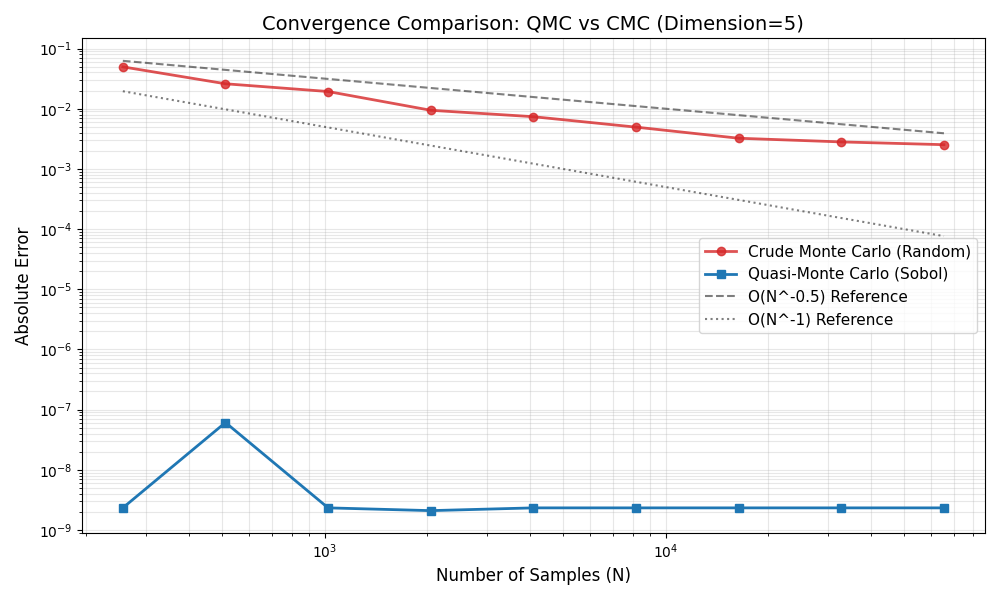

(sec:QuasiMC)=
# Quasi-Monte Carlo

Quasi-Monte Carlo (QMC) refers to a series
of methods that use a deterministic sequence
of random samples across an event space. This property
differs from Crude Monte Carlo's stochastic selection of samples from a random variable. And like any other
Monte Carlo method, QMC is a method for finding the
approximate value of a function as an average of the function.

In general, the generic Quasi-Monte Carlo method takes the
same form as {ref}`sec:CrudeMC`:

```{math}
I = \hat{\theta}_N(f) = \frac{1}{N} \sum^{N}_{J_1} g(X_{j})
```

With the worst-case QMC error bounds defined through the
Koksma-Hlawka theorem, which is described in the paper {cite}
`pausinger2015koksma`:

```{math}
E_N(f) = \left| \frac{1}{N} \sum_{i=1}^{N} f(\mathbf{t}_i) - \int_{[0,1]^d} f(y)dy \right| \leq D_N^* V[f].
```

```{raw} latex
\begin{itemize}
    \item $E_N(f)$: The approximation error. It represents the absolute difference between the numerical estimate (the Monte Carlo sum) and the true value of the integral.
    \item $N$: The total number of points used in the sequence to approximate the integral.
    \item $f(\mathbf{t}_i)$: The function being integrated, evaluated at the sample point 
    \item $\mathbf{t}_i$: The sample points (vectors) chosen from a sequence. In Quasi-Monte Carlo (QMC), these are typically from a "low-discrepancy sequence" (like Sobol or Halton sequences) rather than being purely random.
    \item $[0,1]^d$: The domain of integration, representing the $d$-dimensional unit hypercube.
    \item $D_N^*$: The Star Discrepancy of the point set $\{\mathbf{t}_1, ..., \mathbf{t}_N\}$. This measures how uniformly the points are distributed in the unit hypercube. A lower discrepancy means the points cover the space more evenly (fewer gaps and clusters).
    \item $V[f]$: The Hardy-Krause Variation of the function $f$. This measures how much the function fluctuates or how "rough" it is. A flatter function has a lower variation.
    \end{itemize}
```

However, for Quasi-Monte Carlo to work, these deterministic
sequences must be patternless (aka have a uniform-like density
across a space). In mathematics, this property is often referred
to as a low discrepancy sequence. In this section, we use the digital net method of Sobol's Sequences as our low-discrepancy
sequence.

```{raw} latex
To calculate Sobol's sequences, we can use a recursive
algorithm using the XOR operator.

\textbf{Parameters:}
\begin{itemize}
    \item Primitive Polynomial: $P(x) = x + 1$ (Degree $s=1$).
    \item Recurrence: $m_i = 2m_{i-1} \oplus m_{i-1}$.
    \item Definition: $v_i = m_i / 2^i$.
\end{itemize}

Step 1. Calculating Direction Numbers ($v_i$)
Assume initial value $m_1 = 1$.
\begin{align*}
    i=1: \quad m_1 &= 1 \implies v_1 = 0.1_2 = 0.5 \\
    i=2: \quad m_2 &= (1 \ll 1) \oplus 1 = 3 \implies v_2 = 0.11_2 = 0.75 \\
    i=3: \quad m_3 &= (3 \ll 1) \oplus 3 = 5 \implies v_3 = 0.101_2 = 0.625
\end{align*}

Step 2. Sequence Generation ($x_n$)
Using $x_n = b_1 v_1 \oplus b_2 v_2 \oplus \dots$ where $n = (\dots b_2 b_1)_2$.

\begin{table}[h]
    \centering
    \begin{tabular}{c c l l}
    \toprule
    $n$ & Binary ($b_3 b_2 b_1$) & XOR Calculation & Result ($x_n$) \\
    \midrule
    1 & $001$ & $v_1$ & $0.5$ \\
    2 & $010$ & $v_2$ & $0.75$ \\
    3 & $011$ & $v_1 \oplus v_2 = 0.100_2 \oplus 0.110_2$ & $0.25$ \\
    4 & $100$ & $v_3$ & $0.625$ \\
    5 & $101$ & $v_1 \oplus v_3 = 0.100_2 \oplus 0.101_2$ & $0.125$ \\
    \bottomrule
    \end{tabular}
\end{table}
```

However, it is easier to use a function from a Python Package
to calculate Sobol's sequences, as the following code shows:

```{code} python
import numpy as np
from scipy.stats import qmc

dimensions = 2
# For best properties, use n = 2**m points
num_points_log2 = 3
num_points = 2**num_points_log2

# Scrambling can improve the quality and allow for confidence intervals
sampler = qmc.Sobol(d=dimensions, scramble=True)
sobol_sequence = sampler.random_base2(m=num_points_log2)

print(f"Generated {num_points} points in {dimensions} dimensions:")
print(sobol_sequence)
```

Because of these qualities, QMC will have asymptotically faster convergence than {ref}`sec:CrudeMC`, meaning it takes fewer
samples for QMC to converge into the value of the parameter of
interest, if it exists.

## Why use QMC?

The problem with Crude Monte Carlo is sample clumping,
meaning that when samples come from the random value
they tend to over-represent a section of the random value
which poses two problems:

1) This may distort the results from the Monte Carlo
Method, increasing the error of the estimator;
2) It also increases the number of samples required to
obtain an estimator value within the confidence interval.

As seen below, the convergence and accuracy of QMC is
superior on continuous, smooth functions without high-dimensionality.



```{code} python
import numpy as np
import matplotlib.pyplot as plt
from scipy.stats import qmc

def test_function(x):
    """
    A simple smooth function: Sum of squares.
    f(x) = sum(x_i^2)
    Analytical Integral over [0,1]^d is d/3.
    """
    return np.sum(x**2, axis=1)

def run_comparison():
    dim = 5
    true_value = dim / 3.0 
    m_values = np.arange(8, 17)  # Powers of 2 from 2^8 to 2^16
    n_values = 2**m_values
    
    errors_qmc = []
    errors_cmc = []
    
    for n in n_values:
        # --- Quasi-Monte Carlo (Sobol) ---
        sampler = qmc.Sobol(d=dim, scramble=True)
        sample_qmc = sampler.random(n)
        evals_qmc = test_function(sample_qmc)
        est_qmc = np.mean(evals_qmc)
        errors_qmc.append(abs(est_qmc - true_value))
        
        # --- Crude Monte Carlo (Random) ---
        cmc_replicates = 10
        temp_errors = []
        for _ in range(cmc_replicates):
            sample_cmc = np.random.uniform(0, 1, size=(n, dim))
            evals_cmc = test_function(sample_cmc)
            est_cmc = np.mean(evals_cmc)
            temp_errors.append(abs(est_cmc - true_value))
        
        # Take the average error of the replicates
        errors_cmc.append(np.mean(temp_errors))

    plt.figure(figsize=(10, 6))
    plt.loglog(n_values, errors_cmc, 'o-', label='Crude Monte Carlo (Random)', 
               color='#d62728', alpha=0.8, linewidth=2)
    plt.loglog(n_values, errors_qmc, 's-', label='Quasi-Monte Carlo (Sobol)', 
               color='#1f77b4', linewidth=2)
    
    # Add theoretical convergence lines for reference
    # CMC theoretically converges at O(N^-0.5)
    plt.loglog(n_values, 1.0/np.sqrt(n_values), 'k--', alpha=0.5, label='O(N^-0.5) Reference')
    # QMC theoretically converges closer to O(N^-1)
    plt.loglog(n_values, 5.0/n_values, 'k:', alpha=0.5, label='O(N^-1) Reference')

    plt.xlabel('Number of Samples (N)', fontsize=12)
    plt.ylabel('Absolute Error', fontsize=12)
    plt.title(f'Convergence Comparison: QMC vs CMC (Dimension={dim})', fontsize=14)
    plt.grid(True, which="both", ls="-", alpha=0.3)
    plt.legend(fontsize=11)
    
    plt.tight_layout()
    plt.show()

if __name__ == "__main__":
    run_comparison()
```

### Confidence Intervals

QMC without randomization does not have easily calculable
confidence intervals, meaning that we have to modify QMC t


### Why not use QMC for Everything?

For most problems, QMC is easily interchangeable with Crude 
Monte Carlo and preforms better (lower error and faster
convergence). However, there are several limitations to
QMC that might Crude Monte Carlo more feasible for certain
problems:

1)
2)
3)

These problems come from the fundamental method for Quasi-Monte
Carlo